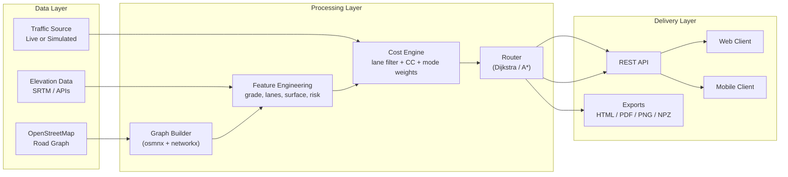

[](README.md)
[](README.tr.md)

<div align="center">


# MOTOMAP

### Intelligent Route Optimization Engine for Motorcyclists

[](LICENSE)
[](https://python.org)
[](https://github.com/alipasha03/motomap/releases/tag/v0.4.0)
[]()

*Most navigation apps optimize for cars.*
*MOTOMAP models the physical advantages and constraints of motorcycles*
*to produce rider-specific routes instead of generic car routes.*

</div>

---

## Overview

MOTOMAP is an open-source routing engine focused on motorcycle behavior rather than general-purpose car navigation. The project combines OSM road graphs, elevation and grade data, traffic-aware travel times, and rider preferences to produce routes that are faster, safer, or more enjoyable depending on the selected mode.

Documentation map:

- [System layers and calibration loop](docs/architecture/system-layers-and-calibration.md)
- [Istanbul-Antalya 10K benchmark](docs/benchmark/istanbul-antalya-10k.md)
- [Valhalla integration discussion response](docs/discussions/2026-03-02-discussion-8-response.md)
- [OSM filtering and API resilience plan](docs/plans/2026-02-28-osm-filtering-api-resilience.md)
- [Phase 1 data infrastructure design](docs/plans/2026-02-28-phase1-data-infrastructure-design.md)
- [Phase 1 implementation plan](docs/plans/2026-02-28-phase1-implementation.md)
- [Research note: Valhalla, Google, SUMO, OSM traces, GeoLife](docs/research/2026-03-02-valhalla-google-sumo-osm-geolife-kaynak-notu.md)

---

## Why MOTOMAP?

Existing map products such as Google Maps, Yandex, and Apple Maps usually return the same route for every road vehicle. That breaks down in dense urban traffic where motorcycles can filter between lanes, react differently to steep grades, and legally or practically avoid some roads that work for cars.

Example:

> In heavy E-5 traffic, cars may be nearly stationary while motorcycles can still move between lanes. A car-oriented ETA can easily overestimate motorcycle travel time by a large margin.

MOTOMAP treats that difference as a routing problem, not just a UI feature.

---

## Core Capabilities

### 1. Lane-filtering travel-time model

Moto speed is estimated from the forward lane count and current traffic conditions:

$$
V_{moto} = \begin{cases}
V_{car} + 5 & \text{if } n_{lane} = 1 \\
\max(V_{car} + 15,\ 25) & \text{if } n_{lane} = 2 \\
\max(V_{car} + 20,\ 35) & \text{if } n_{lane} \geq 3
\end{cases}
$$

Where:

- $V_{moto}$ is the estimated motorcycle speed in km/h
- $V_{car}$ is the observed or simulated car speed in km/h
- $n_{lane}$ is the number of forward lanes

If traffic is already flowing close to the speed limit, the lane-filtering bonus is disabled and motorcycles follow the same effective speed as cars.

### 2. Engine-displacement-aware routing

Small-displacement motorcycles should not be routed like highway-capable bikes.

Highway restriction:

$$
C_{highway}(e) = \begin{cases}
\infty & \text{if } CC \leq 50 \text{ and } e \in \{motorway, trunk\} \\
1.0 & \text{otherwise}
\end{cases}
$$

Grade penalty:

$$
C_{grade}(\alpha, CC) = \begin{cases}
10.0 & \text{if } CC \leq 50 \text{ and } |\alpha| > 12\% \\
3.0 & \text{if } CC \leq 50 \text{ and } 8\% < |\alpha| \leq 12\% \\
1.5 & \text{if } CC \leq 50 \text{ and } 5\% < |\alpha| \leq 8\% \\
1.0 & \text{otherwise}
\end{cases}
$$

### 3. Two riding modes

Commute mode minimizes travel time.

$$
\min_{P \in \mathcal{P}} \sum_{e \in P} T_{moto}(e)
$$

Touring mode rewards surface quality, curvature, and scenic preference while penalizing unwanted surfaces or straight, low-interest segments.

### 4. Toll and free-route comparison

The routing flow can evaluate a toll-permitted candidate and a toll-free candidate together:

$$
P_{free}=\arg\min_{P:U(e)=0\ \forall e\in P}\sum_{e\in P}C_0(e)
$$

This lets the engine compare practical travel-time savings against user toll preferences.

---

## Architecture

### System view



### Composite edge cost

The route engine minimizes the following combined edge weight:

$$
W(e) = T_{moto}(e) \times C_{highway}(e) \times C_{grade}(e) \times C_{mode}(e)
$$

| Component | Meaning |
|---|---|
| $T_{moto}(e)$ | motorcycle travel time on the edge |
| $C_{highway}(e)$ | legal highway restriction factor |
| $C_{grade}(e)$ | engine-size-sensitive slope penalty |
| $C_{mode}(e)$ | commute or touring preference multiplier |

### Forward lane count

OSM commonly stores total lanes rather than direction-specific lanes. The forward lane estimate is:

$$
n_{lane}^{forward} = \begin{cases}
n_{total} & \text{if } oneway = true \\
\max\left(1,\ \left\lfloor \dfrac{n_{total}}{2} \right\rfloor\right) & \text{if } oneway = false
\end{cases}
$$

---

## Data Sources

| Data | Source | Typical use |
|---|---|---|
| Road network | OpenStreetMap | topology, road class, lanes, speed tags |
| Elevation | SRTM / Google / OpenTopo | node elevation, edge grade, grade penalties |
| Traffic | IBB API or simulation | motorcycle travel-time estimation |
| Surface / bridge / tunnel tags | OSM edge attributes | touring preferences and rider warnings |

Key OSM tags used by the project:

- `highway`
- `lanes`
- `oneway`
- `maxspeed`
- `surface`
- `bridge`
- `tunnel`
- `incline`

---

## Tech Stack

| Library | Version target | Purpose |
|---|---|---|
| `osmnx` | 1.9+ / 2.x | OSM download and graph enrichment |
| `networkx` | 3.0+ | graph operations and routing |
| `pandas` | 2.0+ | tabular cleaning and evaluation |
| `geopandas` | 0.14+ | geospatial processing |
| `numpy` | 1.24+ | simulation and metrics |
| `folium` | 0.15+ | interactive map output |
| `rasterio` | 1.3+ | GeoTIFF elevation workflows |

---

## Installation

```bash
python -m venv venv
source venv/bin/activate  # Windows: venv\\Scripts\\activate
pip install -r requirements.txt
```

If you are using DEM-based workflows, download Istanbul elevation data and save it in the project root as `istanbul_dem.tif`.

Suggested sources:

- [USGS EarthExplorer](https://earthexplorer.usgs.gov/)
- [Copernicus DEM](https://spacedata.copernicus.eu/)
- [CGIAR-CSI SRTM](https://srtm.csi.cgiar.org/)

---

## Quick Start

```python
from motomap import motomap_graf_olustur, maliyetleri_hesapla_ve_grafa_ekle, rota_ciz

G = motomap_graf_olustur("Kadikoy, Istanbul, Turkey", "istanbul_dem.tif")
G = maliyetleri_hesapla_ve_grafa_ekle(G, motor_cc=50, surus_amaci="is_icin")
rota_ciz(G, baslangic_node, bitis_node)
```

Expected output:

- a graph enriched with elevation and cleaned OSM attributes
- route cost annotations for the selected motorcycle and mode
- an exported route visualization such as `motomap_test_rotasi.html`

---

## Existing Outputs

Current sample artifacts produced from OSM plus elevation processing:

- `outputs/dem_api/moda_kadikoy_dem_api_map.npz`
- `outputs/dem_api/moda_kadikoy_dem_api_map.pdf`
- `outputs/dem_api/moda_kadikoy_dem_api_map.svg`
- `outputs/dem_api/moda_kadikoy_elevation_3d.pdf`
- `outputs/dem_api/moda_kadikoy_elevation_3d.png`

Generation commands:

```bash
python -m scripts.dem_api_map_export --place "Moda, Kadikoy, Istanbul, Turkey" --output-dir outputs/dem_api --basename moda_kadikoy_dem_api_map
python -m scripts.elevation_3d_plot --npz outputs/dem_api/moda_kadikoy_dem_api_map.npz --png-output outputs/dem_api/moda_kadikoy_elevation_3d.png --pdf-output outputs/dem_api/moda_kadikoy_elevation_3d.pdf
```

---

## Implementation Roadmap

High-level phase plan:

1. Data infrastructure: graph loading, elevation, cleaning, validation
2. Core routing: lane filtering, CC restrictions, grade penalties, cost engine, router
3. Touring mode: surface preferences, sinuosity, scenic weighting
4. Evaluation and simulation: benchmarks, map matching, metrics, visualization
5. Delivery: API layer, live traffic integration, mobile MVP

The detailed implementation plans live in [docs/plans](docs/plans/).

---

## Project Status

- Completed: algorithm framing, documentation baseline, initial data pipeline, benchmark planning
- In progress: routing calibration, OSM filtering, benchmark execution, backend hardening
- Planned: production API, live traffic integration, mobile product surface

Open GitHub issues observed via `gh`:

- `#13` open: emergency-lane handling during lane filtering
- `#12` open: cross-continental Istanbul routing test with bridges and ferry options

---

## Parameter Summary

| Parameter | Symbol | Source | Effect |
|---|---:|---|---|
| Motorcycle displacement | $CC$ | user profile | enables/disables highway access and grade penalties |
| Forward lane count | $n_{lane}$ | OSM `lanes` + `oneway` | increases lane-filtering speed advantage |
| Road grade | $\alpha$ | DEM / elevation APIs | raises edge cost on steep climbs |
| Surface | `surface` | OSM | affects touring preferences |
| Riding mode | `mode` | user input | switches objective between time and enjoyment |
| Car speed | $V_{car}$ | live traffic or simulation | drives lane-filtering ETA model |
| Speed limit | $V_{max}$ | OSM `maxspeed` | caps optimistic motorcycle speed |

---

## Version Notes

The repository currently has a Git tag at `v0.4.0`. Some application manifests still report `1.0.0` as a local package/API version, so release versioning is not yet fully normalized across the repo.

---

## License

This project is licensed under the [MIT License](LICENSE).

## Authors

**Ali Ozuysal**
**Muhammet Yagcioglu**

---

<div align="center">

*MOTOMAP — because motorcycle routes should not be treated like car routes.*

</div>
