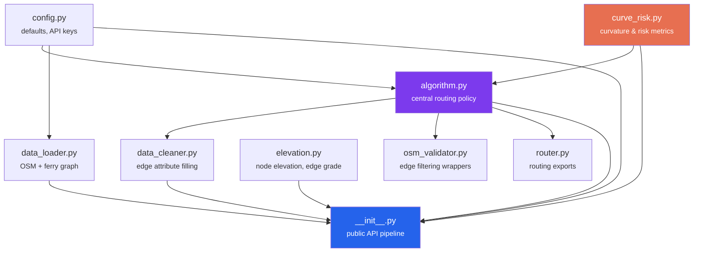
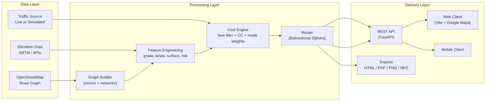

[](README.md)
[](README.tr.md)

<div align="center">


# MOTOMAP

### Intelligent Route Optimization Engine for Motorcyclists

[](LICENSE)
[](https://python.org)
[](https://github.com/alipasha03/motomap/releases/tag/v0.4.0)
[]()

*Most navigation apps optimize for cars.*
*MOTOMAP models the physical advantages and constraints of motorcycles*
*to produce rider-specific routes instead of generic car routes.*

</div>

---

## Table of Contents

- [Overview](#overview)
- [Why MOTOMAP?](#why-motomap)
- [Project Structure](#project-structure)
- [Module Dependency Graph](#module-dependency-graph)
- [Core Algorithm](#core-algorithm)
  - [1. Composite Edge Cost](#1-composite-edge-cost)
  - [2. Travel Time Estimation](#2-travel-time-estimation)
  - [3. Lane-Filtering Speed Model](#3-lane-filtering-speed-model)
  - [4. Forward Lane Count](#4-forward-lane-count)
  - [5. Engine Displacement (CC) Penalties](#5-engine-displacement-cc-penalties)
  - [6. Riding Modes](#6-riding-modes)
  - [7. Curvature and Risk Analysis](#7-curvature-and-risk-analysis)
  - [8. Bidirectional Dijkstra Search](#8-bidirectional-dijkstra-search)
  - [9. Toll-Aware Route Selection](#9-toll-aware-route-selection)
- [Architecture](#architecture)
- [Data Sources](#data-sources)
- [Tech Stack](#tech-stack)
- [Installation](#installation)
- [Quick Start](#quick-start)
- [Testing](#testing)
- [Scripts and Tooling](#scripts-and-tooling)
- [Website and API](#website-and-api)
- [Existing Outputs](#existing-outputs)
- [Documentation Map](#documentation-map)
- [Implementation Roadmap](#implementation-roadmap)
- [Project Status](#project-status)
- [Parameter Summary](#parameter-summary)
- [Version Notes](#version-notes)
- [License](#license)
- [Authors](#authors)

---

## Overview

MOTOMAP is an open-source routing engine focused on motorcycle behavior rather than general-purpose car navigation. The project combines OSM road graphs, elevation and grade data, traffic-aware travel times, and rider preferences to produce routes that are faster, safer, or more enjoyable depending on the selected mode.

The core routing algorithm lives in a single policy module ([`motomap/algorithm.py`](motomap/algorithm.py)) that the entire project depends on. All cost functions, filtering rules, and search logic are centralized there, preventing rule duplication across loaders, validators, and API code.

---

## Why MOTOMAP?

Existing map products such as Google Maps, Yandex, and Apple Maps usually return the same route for every road vehicle. That breaks down in dense urban traffic where motorcycles can filter between lanes, react differently to steep grades, and legally or practically avoid some roads that work for cars.

Example:

> In heavy E-5 traffic, cars may be nearly stationary while motorcycles can still move between lanes. A car-oriented ETA can easily overestimate motorcycle travel time by a large margin.

MOTOMAP treats that difference as a routing problem, not just a UI feature.

---

## Project Structure

```
motomap/                          # Core Python package
  __init__.py                     # Public API: motomap_graf_olustur() pipeline
  algorithm.py                    # Central routing policy (1240 lines)
  config.py                       # Defaults: speed limits, lane counts, surface
  curve_risk.py                   # Curvature & slope risk metrics
  data_cleaner.py                 # Edge attribute filling via algorithm policy
  data_loader.py                  # OSM graph + ferry layer composition
  elevation.py                    # Elevation API with retry/fallback/degrade
  osm_validator.py                # Compatibility wrappers for edge filtering
  router.py                       # Compatibility exports for routing functions

tests/                            # Test suite
  test_algorithm.py               # Core algorithm unit + randomized tests
  test_curve_risk.py              # Curvature analysis tests
  test_data_cleaner.py            # Edge cleaning tests
  test_data_loader.py             # Graph loading tests
  test_public_api.py              # Package public API tests
  test_router.py                  # Routing function tests
  test_benchmark_istanbul_antalya.py  # Long-distance benchmark
  test_website_comparison_suite.py    # Website comparison suite tests
  test_elevation.py               # Elevation integration tests
  test_elevation_resilience.py    # Elevation API failure tests
  test_osm_validator.py           # Validator tests

scripts/                          # Standalone tooling
  dem_api_map_export.py           # DEM/API enriched map export (NPZ+PDF+SVG)
  blender_terrain_render.py       # 4K 3D terrain render via Blender
  elevation_3d_plot.py            # 3D elevation matplotlib plot
  build_combined_report.py        # Combined report builder
  generate_english_research_pdfs.py  # Research PDF generation

website/                          # Proof-of-concept web client
  index.html                      # Single-page map proof deck
  src/main.ts                     # TypeScript: Google Maps rendering
  generate_route.py               # Multi-case comparison suite generator
  comparison_suite.py             # Case definitions & evidence builder
  calibrate_istanbul_advanced.py  # Advanced Istanbul calibration
  calibrate_no_real_rider_data.py # Calibration without real rider data
  evaluate_with_google.py         # Google baseline evaluation
  benchmark_istanbul_antalya_10k.py  # 10K benchmark runner
  vite.config.ts                  # Vite build configuration

app/                              # Mirror package (Replit deployment)
  api/main.py                     # FastAPI REST API server
  motomap/                        # Mirrored core package
  tests/                          # Mirrored test suite
  website/                        # Mirrored website scripts

docs/                             # Project documentation
  architecture/                   # Algorithm reference, system layers
  benchmark/                      # Istanbul-Antalya 10K benchmark
  plans/                          # Implementation plans
  research/                       # Research notes
  discussions/                    # Community discussion responses
```

---

## Module Dependency Graph



All routing policy constants, filtering rules, cost functions, and search logic flow through `algorithm.py`. Other modules either feed data into it or re-export from it.

---

## Core Algorithm

Every formula below is linked to the exact file and line where it is implemented.

### 1. Composite Edge Cost

The route engine minimizes the following combined edge weight:

$$
W(e) = T_{moto}(e) \times C_{highway}(e) \times C_{grade}(e) \times C_{mode}(e)
$$

| Component | Meaning |
|---|---|
| $T_{moto}(e)$ | motorcycle travel time on the edge |
| $C_{highway}(e)$ | legal highway restriction factor |
| $C_{grade}(e)$ | engine-size-sensitive slope penalty |
| $C_{mode}(e)$ | commute or touring preference multiplier |

> **Implementation:** [`motomap/algorithm.py:674-771`](motomap/algorithm.py#L674) &mdash; `build_mode_specific_cost()`
> assembles all multipliers per edge for the selected riding mode.

---

### 2. Travel Time Estimation

Each road edge's travel time is computed using a multi-factor effective speed model
derived from HCM (Highway Capacity Manual) Chapter 23 methodology, adapted for
motorcycle dynamics:

$$
V_{eff}(e) = V_{posted}(e) \times f_{class}(e) \times f_{surface}(e) \times f_{grade}(e) \times f_{global}
$$

$$
T_{road}(e) = \frac{L(e)}{V_{eff}(e) \;/\; 3.6} + \delta_{intersection}(e)
$$

| Factor | Meaning | Source |
|---|---|---|
| $f_{class}$ | Road-class free-flow factor (HCM Table 23-1 adapted) | `FREE_FLOW_SPEED_FACTOR` in config |
| $f_{surface}$ | Pavement quality reduction (motorcycle-specific) | `SURFACE_SPEED_FACTOR` in config |
| $f_{grade}$ | Grade speed reduction: $\max(0.4,\; 1 - 0.35 \times \|grade\|)$ | HCM Exhibit 23-8 simplified |
| $f_{global}$ | Runtime calibration knob (residual congestion proxy) | `MOTOMAP_SPEED_FACTOR` env (default 0.55) |
| $\delta_{intersection}$ | Per-edge intersection delay by road class | `INTERSECTION_DELAY_S` in config |

#### Road-Class Free-Flow Factors

Motorcycles achieve different fractions of the posted speed limit depending on
access control, lateral friction, and intersection density (per HCM methodology):

| Highway type | $f_{class}$ | Intersection delay (s) |
|---|---|---|
| `motorway` | 0.95 | 0.0 |
| `trunk` | 0.92 | 0.0 |
| `primary` | 0.85 | 8.0 |
| `secondary` | 0.80 | 6.0 |
| `tertiary` | 0.75 | 5.0 |
| `residential` | 0.70 | 3.0 |
| `living_street` | 0.60 | 2.0 |
| `service` | 0.55 | 2.0 |

#### Surface-Type Speed Factors

Surface type dramatically affects motorcycle handling.  Factors are derived from
OSRM/Valhalla surface penalties scaled for motorcycle characteristics:

| Surface | $f_{surface}$ | | Surface | $f_{surface}$ |
|---|---|---|---|---|
| asphalt | 1.00 | | compacted | 0.60 |
| concrete | 0.95 | | gravel | 0.45 |
| paving_stones | 0.70 | | dirt / earth | 0.35 |
| cobblestone | 0.55 | | sand | 0.20 |

Ferry edges use OSM `duration` tags when available, otherwise:

$$
T_{ferry}(e) = \frac{L(e)}{V_{ferry} \;/\; 3.6} + \delta_{boarding}
$$

| Parameter | Default | Source |
|---|---|---|
| $f_{global}$ | 0.55 | `MOTOMAP_SPEED_FACTOR` env or profile default |
| $V_{ferry}$ | 18 km/h | `default_ferry_speed_kmh` in profile |
| $\delta_{boarding}$ | 480 s (8 min) | `MOTOMAP_FERRY_BOARDING_DELAY_S` env or profile default |

> **Implementation:** `motomap/algorithm.py` &mdash; `_effective_speed_kmh()` computes the
> multi-factor speed; `_intersection_delay()` returns per-class delay;
> `compute_edge_travel_time()` assembles the final travel time.
>
> **Speed factor tables:** `motomap/config.py` &mdash; `FREE_FLOW_SPEED_FACTOR`,
> `SURFACE_SPEED_FACTOR`, `INTERSECTION_DELAY_S`
>
> **Calibration loader:** `motomap/algorithm.py` &mdash; `runtime_calibration_from_env()`
> reads and clamps override values from environment variables.
>
> **Design note:** Without real-time traffic volume data, the model cannot apply the
> full BPR (Bureau of Public Roads) volume-delay function
> $t = t_{ff} \times [1 + \alpha(V/C)^\beta]$.  The `speed_factor` serves as a
> residual congestion proxy that can be tuned per deployment context or replaced
> with a BPR layer when live traffic feeds become available.

---

### 3. Lane-Filtering Speed Model

Moto speed is estimated from the forward lane count and current traffic conditions:

$$
V_{moto} = \begin{cases}
V_{car} + 5 & \text{if } n_{lane} = 1 \\
\max(V_{car} + 15,\ 25) & \text{if } n_{lane} = 2 \\
\max(V_{car} + 20,\ 35) & \text{if } n_{lane} \geq 3
\end{cases}
$$

Where:

- $V_{moto}$ is the estimated motorcycle speed in km/h
- $V_{car}$ is the observed or simulated car speed in km/h
- $n_{lane}$ is the number of forward lanes

If traffic is already flowing close to the speed limit, the lane-filtering bonus is disabled and motorcycles follow the same effective speed as cars.

> **Note:** The lane-filtering speed model is described here as a design target.
> The current implementation uses `maxspeed * speed_factor` as a practical approximation
> until live traffic data is integrated.
> See [`motomap/algorithm.py:511-537`](motomap/algorithm.py#L511) &mdash; `compute_edge_travel_time()`.

---

### 4. Forward Lane Count

OSM commonly stores total lanes rather than direction-specific lanes. The forward lane estimate is:

$$
n_{lane}^{forward} = \begin{cases}
n_{total} & \text{if } oneway = true \\
\max\left(1,\ \left\lfloor \dfrac{n_{total}}{2} \right\rfloor\right) & \text{if } oneway = false
\end{cases}
$$

> **Implementation:** [`motomap/algorithm.py:392-397`](motomap/algorithm.py#L392) &mdash; `compute_lanes_forward()`
>
> **Default lane counts per highway type:** [`motomap/config.py:35-49`](motomap/config.py#L35) &mdash; `DEFAULT_LANES`

---

### 5. Engine Displacement (CC) Penalties

Small-displacement motorcycles should not be routed like highway-capable bikes.

#### Highway Restriction

$$
C_{highway}(e) = \begin{cases}
10^6 & \text{if } CC \leq 50 \text{ and } e \in \{motorway, trunk\} \\
1.0 & \text{otherwise}
\end{cases}
$$

> **Implementation:** [`motomap/algorithm.py:660-671`](motomap/algorithm.py#L660) &mdash; `cc_highway_penalty()`
>
> **Restricted highway types:** [`motomap/algorithm.py:91-98`](motomap/algorithm.py#L91) &mdash; `CC_RESTRICTED_HIGHWAY_TYPES`

#### Grade Penalty

Three-tier displacement-aware slope penalty:

| CC Range | >4% grade | >6% grade | >8-9% grade | >10-12% grade | >12-14% grade |
|---|---|---|---|---|---|
| $\leq$ 50cc | 1.35x | 2.0x | 3.0x | 3.0x | 6.0x |
| 51-249cc | 1.0x | 1.2x | 1.5x | 1.5x | 2.0x |
| $\geq$ 250cc | 1.0x | 1.0x | 1.0x | 1.15x | 1.35x |

> **Implementation:** [`motomap/algorithm.py:626-657`](motomap/algorithm.py#L626) &mdash; `cc_grade_penalty()`
>
> Grade values come from elevation differences computed by
> [`motomap/elevation.py:89-96`](motomap/elevation.py#L89) &mdash; `add_grade()`.

---

### 6. Riding Modes

Three modes build different edge-weight layers on top of the base travel time:

#### Standard Mode (Commute)

Minimizes travel time with road-type penalties to discourage shortcut-prone connectors near major highways:

$$
W_{standart}(e) = T_{moto}(e) \times C_{grade} \times C_{highway} \times (1 + p_{road})
$$

| Road type | $p_{road}$ | Extra connector penalty |
|---|---|---|
| `service` | 0.45 | +0.85 if short & adjacent to major road |
| `track` | 1.20 | +0.85 if short & adjacent to major road |
| `living_street` | 0.22 | &mdash; |
| `residential` | 0.04 | &mdash; |
| `unclassified` | 0.10 | +0.85 if short & adjacent to major road |

> **Implementation:** [`motomap/algorithm.py:688-718`](motomap/algorithm.py#L688)
> inside `build_mode_specific_cost()` when `surus_modu == "standart"`.
>
> **Road penalty table:** [`motomap/algorithm.py:66-73`](motomap/algorithm.py#L66) &mdash; `STANDART_ROAD_PENALTY`

#### Viraj Keyfi Mode (Curvy Riding)

Rewards curvature and fun-turn density while penalizing dangerous segments:

$$
W_{viraj}(e) = \frac{T_{moto}(e) \times C_{grade} \times C_{highway}}{1 + 0.95 \cdot \kappa + 0.70 \cdot f_{fun} + b_{road}} \times (1 + 0.25 \cdot f_{danger} + 0.45 \cdot h_{risk})
$$

Where:
- $\kappa = \frac{curvature\_score}{1 + curvature\_score}$ &mdash; normalized curvature term
- $f_{fun} = \frac{fun\_density}{2 + fun\_density}$ &mdash; fun turn density per km
- $f_{danger} = \frac{danger\_density}{2 + danger\_density}$ &mdash; danger turn density per km
- $h_{risk} = 1.0$ if hairpin + steep downhill, else $0.0$
- $b_{road}$ = road-type bonus (e.g. `residential` +0.15, `living_street` +0.20)

> **Implementation:** [`motomap/algorithm.py:750-755`](motomap/algorithm.py#L750)
> inside `build_mode_specific_cost()` when `surus_modu == "viraj_keyfi"`.
>
> **Road bonus table:** [`motomap/algorithm.py:47-55`](motomap/algorithm.py#L47) &mdash; `VIRAJ_KEYFI_ROAD_BONUS`

#### Guvenli Mode (Safe Riding)

Aggressively penalizes high-risk segments, steep downhill, and dangerous curvature:

$$
W_{guvenli}(e) = T_{moto}(e) \times C_{grade} \times C_{highway} \times (1 + 0.55 \cdot f_{danger} + 1.40 \cdot h_{risk} + 5.0 \cdot d_{downhill} + p_{road})
$$

Where $d_{downhill} = \max(0,\; |grade| - 0.08)$ for descending edges.

> **Implementation:** [`motomap/algorithm.py:757-766`](motomap/algorithm.py#L757)
> inside `build_mode_specific_cost()` when `surus_modu == "guvenli"`.
>
> **Road penalty table:** [`motomap/algorithm.py:57-64`](motomap/algorithm.py#L57) &mdash; `GUVENLI_ROAD_PENALTY`

---

### 7. Curvature and Risk Analysis

Edges are analyzed for turn characteristics using vectorized angle computation on resampled geometry:

| Metric | Threshold | Purpose |
|---|---|---|
| Fun angle | 15&deg; &ndash; 45&deg; | Enjoyable motorcycle turns |
| Danger angle | > 60&deg; | Sharp dangerous turns |
| Hairpin | danger + short step ($\leq$ 20 m) | Tight switchbacks |
| High-risk zone | hairpin + downhill grade < &minus;8% | Combined slope-curve danger |

**Curvature score** is chunk-normalized to prevent long-distance drift:

$$
\kappa_{chunk} = \frac{fun\_ratio}{1 + danger\_ratio}
$$

$$
curvature\_score = \text{mean}(\kappa_{chunk_1}, \kappa_{chunk_2}, \ldots)
$$

> **Implementation:** [`motomap/curve_risk.py:86-206`](motomap/curve_risk.py#L86) &mdash; `analyze_linestring_curvature()`
>
> **Angle thresholds:** [`motomap/curve_risk.py:12-19`](motomap/curve_risk.py#L12) &mdash; constants
> `FUN_ANGLE_MIN_DEG=15`, `FUN_ANGLE_MAX_DEG=45`, `DANGER_ANGLE_DEG=60`
>
> **Graph annotation:** [`motomap/curve_risk.py:209-235`](motomap/curve_risk.py#L209) &mdash; `add_curve_and_risk_metrics()`
> writes `viraj_katsayisi`, `viraj_fun_sayisi`, `viraj_tehlike_sayisi`, `yuksek_risk_bolge` to each edge.

---

### 8. Bidirectional Dijkstra Search

Routes are found using a custom bidirectional Dijkstra implementation over precomputed indexed adjacency lists:

1. **Index building:** Compact forward + reverse adjacency arrays with best-edge-per-pair lookup, separated into toll-allowed and toll-free variants.
2. **Search:** Forward and backward heaps expand alternately until `forward_min + backward_min >= best_total`.
3. **Path reconstruction:** Forward chain + backward chain joined at the meeting node.

> **Index builder:** [`motomap/algorithm.py:849-927`](motomap/algorithm.py#L849) &mdash; `build_route_search_index()`
>
> **Bidirectional search:** [`motomap/algorithm.py:930-1011`](motomap/algorithm.py#L930) &mdash; `_bidirectional_dijkstra()`
>
> **Public wrapper:** [`motomap/algorithm.py:1014-1043`](motomap/algorithm.py#L1014) &mdash; `shortest_path()`

---

### 9. Toll-Aware Route Selection

The main routing entry point computes both toll-permitted and toll-free alternatives in a single call:

$$
P_{serbest}=\arg\min_{P}\sum_{e\in P}W(e), \qquad
P_{ucretsiz}=\arg\min_{P:\;toll(e)=0\;\forall e\in P}\sum_{e\in P}W(e)
$$

The caller selects via `tercih` parameter: `"ucretli_serbest"` (toll-allowed) or `"ucretsiz"` (toll-free only).

> **Implementation:** [`motomap/algorithm.py:1099-1196`](motomap/algorithm.py#L1099) &mdash; `ucret_opsiyonlu_rota_hesapla()`
>
> **Route summary:** [`motomap/algorithm.py:1046-1096`](motomap/algorithm.py#L1046) &mdash; `summarize_route()`
> aggregates time, distance, toll, ferry, fun count, danger count, and grade metrics.

---

## Architecture

### System View



### End-to-End Pipeline

The graph-building pipeline is exposed as [`motomap_graf_olustur()`](motomap/__init__.py#L18):

| Step | Function | File | Output |
|---:|---|---|---|
| 1 | `load_graph(place)` | [`data_loader.py:16`](motomap/data_loader.py#L16) | OSM road + ferry MultiDiGraph |
| 2 | `filter_motorcycle_edges(G)` | [`algorithm.py:497`](motomap/algorithm.py#L497) | Graph without illegal edges |
| 3 | `add_elevation(G, api_key)` | [`elevation.py:67`](motomap/elevation.py#L67) | Nodes annotated with elevation (m) |
| 4 | `add_grade(G)` | [`elevation.py:89`](motomap/elevation.py#L89) | Edges annotated with grade & grade_abs |
| 5 | `clean_graph(G)` | [`data_cleaner.py:14`](motomap/data_cleaner.py#L14) | Missing attributes filled (lanes, maxspeed, surface, lanes_forward) |

### Elevation Fallback Chain

```
Google Elevation API (if api_key provided, 3 retries)
  └─ Open Topo Data API (free, no key, 3 retries)
       └─ Degrade mode (elevation = 0 for all nodes)
```

> **Implementation:** [`motomap/elevation.py:67-86`](motomap/elevation.py#L67) &mdash; `add_elevation()`

### Motorcycle Edge Filtering

Edges are excluded from the graph when any of these conditions hold:

| Rule | OSM tags checked | Implementation |
|---|---|---|
| Non-motorized highway types | `highway` in {cycleway, footway, pedestrian, path, steps, corridor, bridleway, track} | [`algorithm.py:18-29`](motomap/algorithm.py#L18) |
| Emergency-only | `highway` = emergency_bay | [`algorithm.py:30`](motomap/algorithm.py#L30) |
| Access denied | `access`, `motor_vehicle`, or `motorcycle` in {no, private, emergency} | [`algorithm.py:485-493`](motomap/algorithm.py#L485) |
| Excluded service types | `service` in {parking_aisle, driveway, drive-through, emergency_access} | [`algorithm.py:32-39`](motomap/algorithm.py#L32) |

> **Filter function:** [`motomap/algorithm.py:470-508`](motomap/algorithm.py#L470) &mdash; `is_motorcycle_forbidden()` + `filter_motorcycle_edges()`

### Cache Strategy

The routing module maintains three cache layers to avoid recomputation on repeated calls:

| Cache | Key includes | Stored as |
|---|---|---|
| Travel-time weights | speed_factor, segment_delay, ferry_delay, graph content hash | `graph.graph["_motomap_travel_time_state"]` |
| Mode-specific weights | riding mode, motor_cc, travel-time state, graph content hash | `graph.graph["_motomap_mode_cost_state"]` |
| Search index | weight attr, revision, node/edge count | `graph.graph["_motomap_route_index_cache"]` |

Cache keys include route-relevant graph content (not just edge count) so that in-place edge mutations during preprocessing invalidate stale routes.

> **Cache token builder:** [`motomap/algorithm.py:350-389`](motomap/algorithm.py#L350) &mdash; `_graph_cache_token()`

---

## Data Sources

| Data | Source | Typical use |
|---|---|---|
| Road network | OpenStreetMap | topology, road class, lanes, speed tags |
| Elevation | SRTM / Google / OpenTopo | node elevation, edge grade, grade penalties |
| Traffic | IBB API or simulation | motorcycle travel-time estimation |
| Surface / bridge / tunnel tags | OSM edge attributes | touring preferences and rider warnings |

### Key OSM Tags

| Tag | Example | Role in algorithm | Used by |
|---|---|---|---|
| `highway` | `motorway`, `primary`, `residential` | Road class, CC restriction, default speeds | [`algorithm.py:242`](motomap/algorithm.py#L242) |
| `lanes` | `2`, `4`, `6` | Forward lane count for lane filtering | [`algorithm.py:406`](motomap/algorithm.py#L406) |
| `oneway` | `yes`, `no` | Forward lane derivation | [`algorithm.py:392`](motomap/algorithm.py#L392) |
| `maxspeed` | `50`, `120` | Travel time speed input | [`algorithm.py:251`](motomap/algorithm.py#L251) |
| `surface` | `asphalt`, `gravel` | Touring mode preferences | [`algorithm.py:414`](motomap/algorithm.py#L414) |
| `toll` | `yes`, `no` | Toll-free route filtering | [`algorithm.py:448`](motomap/algorithm.py#L448) |
| `route` / `ferry` | `ferry`, `yes` | Ferry edge detection | [`algorithm.py:460`](motomap/algorithm.py#L460) |
| `duration` | `PT30M`, `0:15` | Ferry crossing time | [`algorithm.py:275`](motomap/algorithm.py#L275) |

### Default Speed Limits (Turkish Road Standards)

Defined in [`motomap/config.py:18-32`](motomap/config.py#L18):

| Highway type | Default maxspeed (km/h) | Default lanes (total) |
|---|---|---|
| `motorway` | 120 | 6 |
| `trunk` | 110 | 4 |
| `primary` | 82 | 4 |
| `secondary` | 70 | 2 |
| `tertiary` | 50 | 2 |
| `residential` | 50 | 2 |
| `living_street` | 20 | 1 |

---

## Tech Stack

| Library | Version target | Purpose |
|---|---|---|
| `osmnx` | 2.0+ | OSM download and graph enrichment |
| `networkx` | 3.0+ | graph operations and routing |
| `pandas` | 2.0+ | tabular cleaning and evaluation |
| `geopandas` | 0.14+ | geospatial processing |
| `numpy` | 1.24+ | simulation and metrics |
| `matplotlib` | 3.8+ | scientific plotting |
| `SciencePlots` | 2.1+ | LaTeX-rendered publication figures |
| `requests` | 2.31+ | Google API calls |
| `python-dotenv` | 1.0+ | environment variable loading |
| `pytest` | 7.0+ | test framework |
| `rich` | 13.7+ | terminal output formatting |
| `tqdm` | 4.66+ | progress bars |
| `rasterio` | 1.3+ | GeoTIFF elevation workflows |
| `folium` | 0.15+ | interactive map output |

---

## Installation

```bash
python -m venv venv
source venv/bin/activate  # Windows: venv\Scripts\activate
pip install -r requirements.txt
```

### Environment Variables

Create a `.env` file in the project root (see `.env.example`):

```
GOOGLE_MAPS_API_KEY=your_key_here
```

Optional runtime overrides for travel-time calibration:

```
MOTOMAP_SPEED_FACTOR=0.55          # real-world speed multiplier (0.2-1.0)
MOTOMAP_SEGMENT_DELAY_S=2.0        # per-edge delay in seconds (0-8)
MOTOMAP_FERRY_BOARDING_DELAY_S=480  # ferry boarding delay in seconds (0-1800)
```

### DEM Data (Optional)

If you are using DEM-based workflows, download Istanbul elevation data and save it in the project root as `istanbul_dem.tif`.

Suggested sources:

- [USGS EarthExplorer](https://earthexplorer.usgs.gov/)
- [Copernicus DEM](https://spacedata.copernicus.eu/)
- [CGIAR-CSI SRTM](https://srtm.csi.cgiar.org/)

---

## Quick Start

```python
from motomap import motomap_graf_olustur
from motomap.algorithm import add_travel_time_to_graph, ucret_opsiyonlu_rota_hesapla

# 1. Build graph with elevation and cleaned attributes
G = motomap_graf_olustur("Kadikoy, Istanbul, Turkey")

# 2. Add travel-time weights to all edges
G = add_travel_time_to_graph(G)

# 3. Compute toll-aware motorcycle route
result = ucret_opsiyonlu_rota_hesapla(
    G,
    source=origin_node,
    target=destination_node,
    tercih="ucretli_serbest",   # or "ucretsiz" for toll-free only
    surus_modu="standart",       # or "viraj_keyfi" or "guvenli"
    motor_cc=250,                # engine displacement in cc
)

print(result["secilen_rota"]["toplam_sure_s"])     # total time (seconds)
print(result["secilen_rota"]["toplam_mesafe_m"])    # total distance (meters)
print(result["secilen_rota"]["viraj_fun_sayisi"])   # fun turn count
```

### Pipeline Functions

| Function | Import path | Purpose |
|---|---|---|
| `motomap_graf_olustur()` | `motomap` | Full graph-building pipeline |
| `add_travel_time_to_graph()` | `motomap.algorithm` | Annotate edges with travel time |
| `ucret_opsiyonlu_rota_hesapla()` | `motomap.algorithm` | Toll-aware routing with mode selection |
| `add_curve_and_risk_metrics()` | `motomap.curve_risk` | Annotate edges with curvature metrics |
| `filter_motorcycle_edges()` | `motomap.algorithm` | Remove non-motorcycle edges |
| `clean_graph()` | `motomap.data_cleaner` | Fill missing OSM attributes |

---

## Testing

```bash
# Run all tests
pytest tests/ -v

# Run specific module tests
pytest tests/test_algorithm.py -v
pytest tests/test_curve_risk.py -v

# Run with coverage
pytest tests/ --cov=motomap --cov-report=term-missing
```

### Test Files

| Test file | Tests | Target |
|---|---|---|
| [`test_algorithm.py`](tests/test_algorithm.py) | Core routing policy, edge weights, search, toll logic | [`algorithm.py`](motomap/algorithm.py) |
| [`test_curve_risk.py`](tests/test_curve_risk.py) | Curvature analysis, risk zone detection | [`curve_risk.py`](motomap/curve_risk.py) |
| [`test_data_cleaner.py`](tests/test_data_cleaner.py) | Attribute filling, lane computation | [`data_cleaner.py`](motomap/data_cleaner.py) |
| [`test_data_loader.py`](tests/test_data_loader.py) | Graph loading, ferry composition | [`data_loader.py`](motomap/data_loader.py) |
| [`test_router.py`](tests/test_router.py) | Routing function exports | [`router.py`](motomap/router.py) |
| [`test_public_api.py`](tests/test_public_api.py) | Package public API surface | [`__init__.py`](motomap/__init__.py) |
| [`test_benchmark_istanbul_antalya.py`](tests/test_benchmark_istanbul_antalya.py) | Long-distance 10K routing benchmark | Cross-module integration |
| [`test_website_comparison_suite.py`](tests/test_website_comparison_suite.py) | Website comparison suite logic | [`website/comparison_suite.py`](website/comparison_suite.py) |

---

## Scripts and Tooling

| Script | Command | Output |
|---|---|---|
| DEM/API Map Export | `python -m scripts.dem_api_map_export --place "Moda, Kadikoy, Istanbul, Turkey" --output-dir outputs/dem_api` | NPZ + PDF + SVG |
| 3D Elevation Plot | `python -m scripts.elevation_3d_plot --npz outputs/dem_api/moda_kadikoy_dem_api_map.npz` | PNG + PDF |
| Blender 4K Render | `blender -b -P scripts/blender_terrain_render.py -- --npz <file.npz> --output <out.png>` | 4K PNG |
| Research PDFs | `python -m scripts.generate_english_research_pdfs` | PDF reports |
| Combined Report | `python -m scripts.build_combined_report` | Merged report |

---

## Website and API

### Web Client

The proof-of-concept website ([`website/`](website/)) renders MotoMap routes alongside Google Maps baselines on a single map:

```bash
cd website
npm install
npm run dev    # starts Vite dev server
```

Requires `VITE_GOOGLE_MAPS_API_KEY` in `website/.env`.

### Route Generation

Generate real route comparison data:

```bash
python -m website.generate_route
```

This creates `website/routes/comparison_suite.json` with 3 test cases, each containing:
- Google Maps baseline route
- 3 MotoMap mode routes (standart, viraj_keyfi, guvenli)
- Evidence checks comparing MotoMap vs Google

> **Generator:** [`website/generate_route.py`](website/generate_route.py)
> **Case definitions:** [`website/comparison_suite.py`](website/comparison_suite.py)

### REST API

```bash
cd app
uvicorn api.main:app --reload
```

| Endpoint | Method | Response |
|---|---|---|
| `/api/health` | GET | `{"status": "ok", "service": "MOTOMAP API"}` |
| `/api/route` | GET | Generated route data or demo fallback |
| `/api/route/info` | GET | Data source metadata |

> **Implementation:** [`app/api/main.py`](app/api/main.py)

---

## Existing Outputs

Current sample artifacts produced from OSM plus elevation processing:

- `outputs/dem_api/moda_kadikoy_dem_api_map.npz`
- `outputs/dem_api/moda_kadikoy_dem_api_map.pdf`
- `outputs/dem_api/moda_kadikoy_dem_api_map.svg`
- `outputs/dem_api/moda_kadikoy_elevation_3d.pdf`
- `outputs/dem_api/moda_kadikoy_elevation_3d.png`

---

## Documentation Map

| Document | Path | Description |
|---|---|---|
| Routing algorithm reference | [`docs/architecture/routing-algorithm-reference.md`](docs/architecture/routing-algorithm-reference.md) | Maintainer guide for `algorithm.py` |
| System layers and calibration | [`docs/architecture/system-layers-and-calibration.md`](docs/architecture/system-layers-and-calibration.md) | Calibration loop design |
| Istanbul-Antalya 10K benchmark | [`docs/benchmark/istanbul-antalya-10k.md`](docs/benchmark/istanbul-antalya-10k.md) | Long-distance benchmark spec |
| Valhalla discussion response | [`docs/discussions/2026-03-02-discussion-8-response.md`](docs/discussions/2026-03-02-discussion-8-response.md) | Integration discussion |
| OSM filtering & API resilience | [`docs/plans/2026-02-28-osm-filtering-api-resilience.md`](docs/plans/2026-02-28-osm-filtering-api-resilience.md) | Filtering plan |
| Phase 1 data infrastructure | [`docs/plans/2026-02-28-phase1-data-infrastructure-design.md`](docs/plans/2026-02-28-phase1-data-infrastructure-design.md) | Data layer design |
| Phase 1 implementation plan | [`docs/plans/2026-02-28-phase1-implementation.md`](docs/plans/2026-02-28-phase1-implementation.md) | Implementation plan |
| Research: Valhalla, Google, SUMO | [`docs/research/2026-03-02-valhalla-google-sumo-osm-geolife-kaynak-notu.md`](docs/research/2026-03-02-valhalla-google-sumo-osm-geolife-kaynak-notu.md) | Literature review |
| LaTeX algorithm document | [`docs/architecture/motomap_algorithm_dijkstra.tex`](docs/architecture/motomap_algorithm_dijkstra.tex) | Formal algorithm spec |

---

## Implementation Roadmap

High-level phase plan:

1. **Data infrastructure:** graph loading, elevation, cleaning, validation
2. **Core routing:** lane filtering, CC restrictions, grade penalties, cost engine, router
3. **Touring mode:** surface preferences, sinuosity, scenic weighting
4. **Evaluation and simulation:** benchmarks, map matching, metrics, visualization
5. **Delivery:** API layer, live traffic integration, mobile MVP

The detailed implementation plans live in [`docs/plans/`](docs/plans/).

---

## Project Status

- Completed: algorithm framing, documentation baseline, initial data pipeline, benchmark planning
- In progress: routing calibration, OSM filtering, benchmark execution, backend hardening
- Planned: production API, live traffic integration, mobile product surface

Open GitHub issues observed via `gh`:

- `#13` open: emergency-lane handling during lane filtering
- `#12` open: cross-continental Istanbul routing test with bridges and ferry options

---

## Parameter Summary

| Parameter | Symbol | Source | Effect | Implementation |
|---|---:|---|---|---|
| Motorcycle displacement | $CC$ | user profile | enables/disables highway access and grade penalties | [`algorithm.py:626`](motomap/algorithm.py#L626), [`algorithm.py:660`](motomap/algorithm.py#L660) |
| Forward lane count | $n_{lane}$ | OSM `lanes` + `oneway` | increases lane-filtering speed advantage | [`algorithm.py:392`](motomap/algorithm.py#L392) |
| Road grade | $\alpha$ | DEM / elevation APIs | raises edge cost on steep climbs | [`elevation.py:89`](motomap/elevation.py#L89) |
| Surface | `surface` | OSM | affects touring preferences | [`config.py:51`](motomap/config.py#L51) |
| Riding mode | `mode` | user input | switches objective between time and enjoyment | [`algorithm.py:674`](motomap/algorithm.py#L674) |
| Car speed | $V_{car}$ | live traffic or simulation | drives lane-filtering ETA model | [`algorithm.py:511`](motomap/algorithm.py#L511) |
| Speed limit | $V_{max}$ | OSM `maxspeed` | caps optimistic motorcycle speed | [`config.py:18`](motomap/config.py#L18) |
| Toll flag | `toll` | OSM | toll-free route filtering | [`algorithm.py:448`](motomap/algorithm.py#L448) |
| Ferry flag | `route`/`ferry` | OSM | ferry edge detection and timing | [`algorithm.py:460`](motomap/algorithm.py#L460) |

---

## Version Notes

The repository currently has a Git tag at `v0.4.0`. Some application manifests still report `1.0.0` as a local package/API version, so release versioning is not yet fully normalized across the repo.

---

## License

This project is licensed under the [MIT License](LICENSE).

## Authors

**Ali Ozuysal**
**Muhammet Yagcioglu**

---

<div align="center">

*MOTOMAP -- because motorcycle routes should not be treated like car routes.*

</div>
