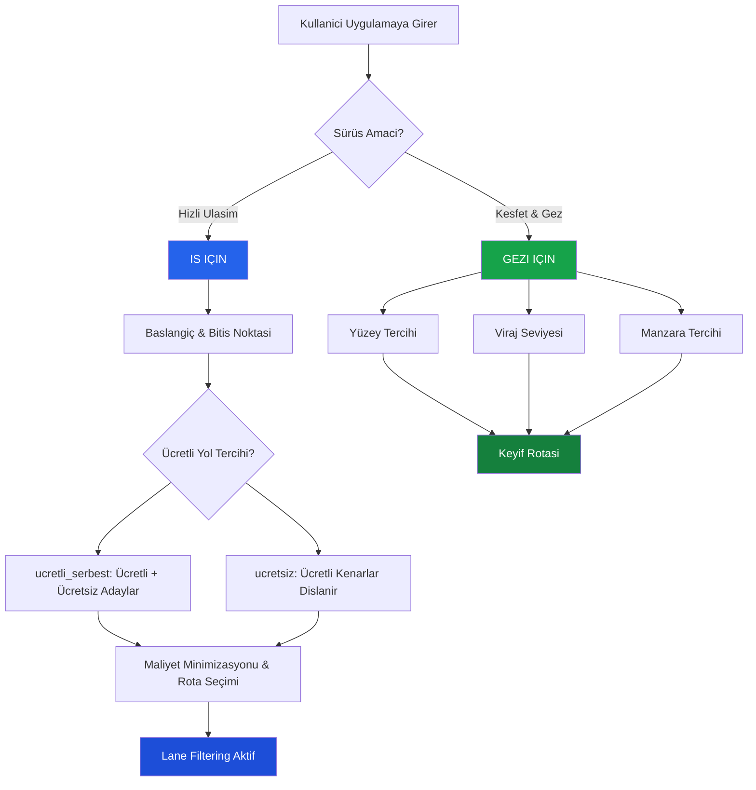
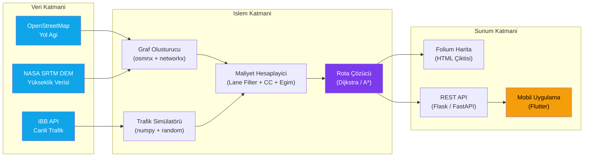
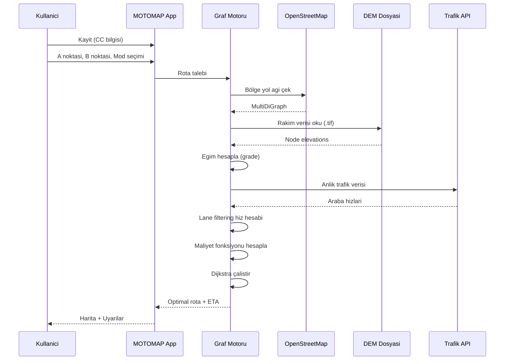
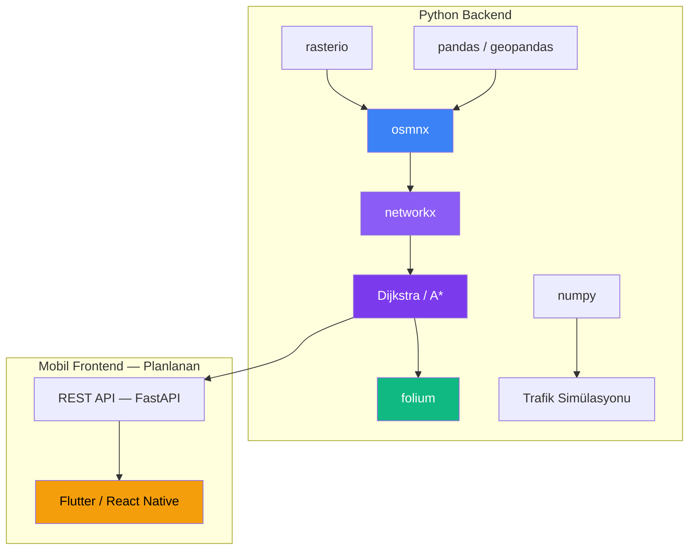
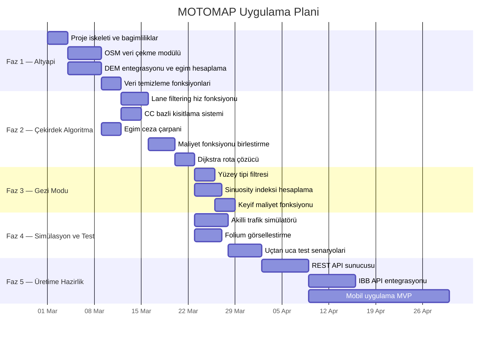
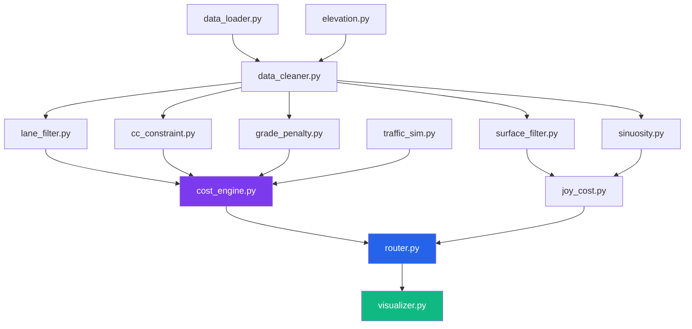

[](README.md)
[](README.tr.md)

<div align="center">


# MOTOMAP

### Motosikletçiler Için Akilli Rota Optimizasyon Motoru

[](LICENSE)
[](https://python.org)
[](https://github.com/alipasha03/motomap/releases/tag/v0.6.0)
[]()

*Standart navigasyon uygulamalari arabalara göre rota çizerken,*
*MOTOMAP motosikletlerin fiziksel avantajlarini ve kisitlamalarini matematiksel olarak modelleyerek*
*bireysellestirilmis rotalar üretir.*

</div>

---

## v0.6.0 Guncellemesi

Bu surumde README, algoritma ve release note'lar yeni canli trafik modeline gore guncellendi.

- Canli trafik destekli rota maliyeti: `vc_ratio`, `traffic_volume_vph`, trafik hiz kategorileri ve `traffic_speed_kmh` artik dogrudan hiz modeline giriyor.
- BPR + live speed blending: yapisal sikisiklik modeli ile canli gozlem birlestiriliyor.
- Baglama duyarli lane filtering: tunnel, gece, agir tasit payi, dar serit ve hava kosullari filtreleme avantajini azaltabiliyor veya kapatabiliyor.
- Weather ve incident-aware route cost: `weather_overall_safety` ve `incident_severity` artik rota agirligina giriyor.
- Otomatik cache invalidation: edge trafik verisi degisince travel time tekrar hesaplaniyor.

Detaylar:

- [`docs/releases.html`](docs/releases.html)
- [`docs/release-notes/v0.6.0.md`](docs/release-notes/v0.6.0.md)
- [`docs/research/2026-04-12-live-traffic-motorcycle-routing.md`](docs/research/2026-04-12-live-traffic-motorcycle-routing.md)

---

## Içindekiler

- [Neden MOTOMAP?](#neden-motomap)
- [Temel Özellikler](#temel-özellikler)
- [Teknik Mimari](#teknik-mimari)
- [Veri Kaynaklari](#veri-kaynaklari)
- [Teknoloji Yigini](#teknoloji-yigini)
- [Kurulum](#kurulum)
- [Hizli Baslangiç](#hizli-baslangiç)
- [DEM/API Çiktilari](#demapi-çiktilari)
- [Uygulama Plani (Implementation Plan)](#uygulama-plani-implementation-plan)
- [Proje Durumu](#proje-durumu)
- [Algoritma Parametreleri Özet Tablosu](#algoritma-parametreleri-özet-tablosu)
- [Lisans](#lisans)
- [Yazar](#yazar)

---

## Neden MOTOMAP?

Mevcut navigasyon uygulamalari (Google Maps, Yandex, Apple Maps) tüm araçlara ayni rotayi sunar. Ancak motosikletler trafikte temelden farkli hareket eder:

> Sikisik bir E-5 trafiginde arabalar **duragan** haldeyken, motosikletler serit aralarindan siyrilarak ilerleyebilir. Google Maps "45 dakika" gösterirken, bir motosikletçi ayni mesafeyi **15 dakikada** katedebilir.

MOTOMAP bu farki algoritmik olarak modelleyen **ilk açik kaynak navigasyon motorudur.**

---

## Temel Özellikler

### 1. Serit Filtreleme (Lane Filtering)

Lane filtering artik sabit bir hiz bonusu degil, dusuk hizli mixed-traffic manevrasi olarak modelleniyor. Temel fikir:

$$
V_{moto}(e) =
\min\!\left(
V_{araba}^{*}(e) + \Delta_{serit}(e)\,m_{hava}(e)\,m_{baglam}(e),
V_{filter,max}
\right)
$$

Burada:
- $V_{araba}^{*}$ : BPR + canli trafik ile bulunan araba hizi
- $\Delta_{serit}$ : gidis yonundeki serit sayisina bagli avantaj
- $m_{hava}$ : weather lane-splitting modifier
- $m_{baglam}$ : tunnel, gece, dar serit ve agir tasit gibi baglamsal azalticilar

Filtreleme sadece sikisik ve dusuk hizli trafikte acilir. Trafik akiciysa motor, cevredeki trafik akisina geri doner.

Ek olarak:

- `tunnel=yes` olan kenarlarda filtering bastirilir
- gece kosullarinda avantaj azaltilir
- agir tasit orani yuksekse avantaj azaltilir
- lane width dar ise avantaj azaltilir

---

### 1.1 Canli Trafik ve Hava Katmani

Yeni surumde edge travel time su tip girdilerden beslenebilir:

- `vc_ratio`
- `traffic_volume_vph`
- `traffic_speed_kmh`
- `traffic_confidence`
- `weather_overall_safety`
- `incident_severity`

Bu sayede sistem sadece OSM hiz limitine degil, edge bazli canli trafik ve guvenlik sinyallerine de bakar.

$$
V_{araba}^{*}(e) = (1-\lambda_e)\,V_{BPR}(e) + \lambda_e\,V_{live}(e)
$$

$$
C_{mod,e} = T_e \cdot \left[1 + \omega_{mod}(1-S_e) + \phi_{mod}I_e\right]
$$

---

### 2. Motor Hacmine Göre Bireysel Rota (CC Bazli Optimizasyon)

#### Otoban Kisitlamasi

50cc ve alti motosikletler yasal olarak otobana çikamazlar. Bu kisitlama sonsuz maliyet ile modellenir:

$$
C_{otoban}(e) = \begin{cases}
\infty & \text{if } CC \leq 50 \text{ and } e \in \{motorway, trunk\} \\
1.0 & \text{otherwise}
\end{cases}
$$

#### Egim Cezasi

Düsük hacimli motorlar dik yokuslarda zorlanir. Egim cezasi çarpani:

$$
C_{egim}(\alpha, CC) = \begin{cases}
10.0 & \text{if } CC \leq 50 \text{ and } |\alpha| > 12\% \\
3.0 & \text{if } CC \leq 50 \text{ and } 8\% < |\alpha| \leq 12\% \\
1.5 & \text{if } CC \leq 50 \text{ and } 5\% < |\alpha| \leq 8\% \\
1.0 & \text{otherwise}
\end{cases}
$$

Burada $\alpha$ yolun egim yüzdesidir ve DEM (Digital Elevation Model) verisinden hesaplanir.

| CC Sinifi | Otoban Erisimi | %5-8 Egim | %8-12 Egim | %12+ Egim |
|:---:|:---:|:---:|:---:|:---:|
| $\leq$ 50cc | $\infty$ (engel) | 1.5x | 3.0x | 10.0x |
| 51-249cc | Serbest | 1.0x | 1.2x | 1.5x |
| $\geq$ 250cc | Serbest | 1.0x | 1.0x | 1.0x |

---

### 3. Çift Modlu Sürücü Deneyimi



#### Mod 1 — Is Için: Zaman Minimizasyonu

Hedef fonksiyon:

$$
\min_{P \in \mathcal{P}} \sum_{e \in P} T_{moto}(e)
$$

$\mathcal{P}$: Tüm mümkün rotalar kümesi, $T_{moto}(e)$: Kenar $e$ üzerinde motosiklet geçis süresi.

Ücretli/ücretsiz tercih için iki aday rota birlikte degerlendirilir:

$$
P_{serbest}=\arg\min_{P}\sum_{e\in P}C_0(e),\qquad
P_{ucretsiz}=\arg\min_{P:U(e)=0\ \forall e\in P}\sum_{e\in P}C_0(e)
$$

- `ucretli_serbest`: ücretli + ücretsiz adaylar birlikte optimize edilir.
- `ucretsiz`: ücretli kenarlar hard constraint ile dislanir.

#### Mod 2 — Gezi Için: Keyif Maksimizasyonu

Gezi modunda her kenara ceza/ödül çarpanlari uygulanir:

**Yüzey Tipi Çarpani:**

$$
C_{yüzey}(e) = \begin{cases}
0.5 & \text{if } surface(e) = \text{tercih edilen} \\
1.0 & \text{if } surface(e) = \text{nötr} \\
50.0 & \text{if } surface(e) = \text{istenmeyen}
\end{cases}
$$

**Viraj Skoru (Sinuosity Index):**

Bir yol segmentinin ne kadar virajli oldugu su oranla ölçülür:

$$
S(e) = \frac{L_{gerçek}(e)}{L_{kus\ uçusu}(e)}
$$

- $S = 1.0$ ise yol düz, $S > 1.2$ ise virajli.

**Viraj Ödül Çarpani:**

$$
C_{viraj}(e) = \begin{cases}
0.3 & \text{if } S(e) > 1.2 \text{ (virajli yol ödüllendirilir)} \\
1.5 & \text{if } S(e) \approx 1.0 \text{ (düz yol cezalandirilir)}
\end{cases}
$$

---

## Teknik Mimari

### Sistem Mimarisi



### Nihai Maliyet Fonksiyonu

Dijkstra algoritmasi su bilesik agirlik degerini minimize eder:

$$
W(e) = T_{moto}(e) \times C_{otoban}(e) \times C_{egim}(e) \times C_{mod}(e)
$$

| Bilesen | Formül | Açiklama |
|:---|:---:|:---|
| $T_{moto}(e)$ | $\dfrac{d(e)}{V_{moto}(e) / 3.6}$ | Kenar uzunlugu / motosiklet hizi (saniye) |
| $C_{otoban}(e)$ | $1.0$ veya $\infty$ | CC bazli yasal otoban kisitlamasi |
| $C_{egim}(e)$ | $1.0 - 10.0$ | Yokus yukari egim ceza çarpani |
| $C_{mod}(e)$ | $0.3 - 50.0$ | Gezi modunda yüzey + viraj çarpani |

### Gidis Yönündeki Serit Sayisi

OSM verisi genellikle toplam serit sayisini verir. Gidis yönündeki serit:

$$
n_{serit}^{gidis} = \begin{cases}
n_{toplam} & \text{if } oneway = true \\
\max\left(1,\ \left\lfloor \dfrac{n_{toplam}}{2} \right\rfloor\right) & \text{if } oneway = false
\end{cases}
$$

### Veri Akis Diyagrami



---

## Veri Kaynaklari

| Veri | Kaynak | Format | Kullanim |
|:---|:---|:---:|:---|
| Yol agi (sokak grafi) | OpenStreetMap | `MultiDiGraph` | Topoloji, yol sinifi, serit, hiz limiti |
| Yükseklik / egim | NASA SRTM DEM | `.tif` (GeoTIFF) | Rakim farkindan egim hesabi |
| Anlik trafik | IBB API / Simülasyon | JSON | Araba hizlari (ileride gerçek veri) |
| Yüzey, köprü, tünel | OSM etiketleri | Edge attributes | Gezi modu tercihleri, uyarilar |

### Kullanilan OSM Etiketleri

| Etiket | Örnek Deger | Algoritmadaki Rolü |
|:---|:---|:---|
| `highway` | `motorway`, `primary`, `residential` | Yol sinifi ? otoban kisitlamasi, varsayilan hizlar |
| `lanes` | `2`, `4`, `6` | Lane filtering hiz hesabi |
| `oneway` | `yes`, `no` | Gidis yönündeki serit sayisini bulma |
| `maxspeed` | `50`, `120` | Akici trafikte referans hiz |
| `surface` | `asphalt`, `gravel`, `dirt` | Gezi modu yüzey filtresi |
| `bridge` / `tunnel` | `yes` | GPS kaybi, buzlanma uyarilari |
| `incline` | `10%`, `up` | Egim dogrulamasi |

---

## Teknoloji Yigini



| Kütüphane | Versiyon | Amaç |
|:---|:---:|:---|
| `osmnx` | 1.9+ | OSM'den yol agi indirme, DEM'den rakim ekleme |
| `networkx` | 3.0+ | Graf islemleri, Dijkstra / A* algoritmalari |
| `pandas` | 2.0+ | Veri temizligi, eksik deger doldurma |
| `geopandas` | 0.14+ | Mekânsal veri islemleri |
| `numpy` | 1.24+ | Istatistiksel simülasyon veri üretimi |
| `rasterio` | 1.3+ | DEM GeoTIFF dosyasi okuma |
| `folium` | 0.15+ | Etkilesimli Leaflet harita çiktisi |

---

## Kurulum

```bash
# Sanal ortam olustur
python -m venv venv
source venv/bin/activate  # Windows: venv\Scripts\activate

# Bagimliliklari kur
pip install osmnx networkx pandas geopandas numpy folium rasterio
```

### DEM Verisi Indirme

Istanbul bölgesi için 30m çözünürlüklü SRTM verisini asagidaki kaynaklardan `.tif` formatinda indirin:

- [USGS EarthExplorer](https://earthexplorer.usgs.gov/)
- [Copernicus DEM](https://spacedata.copernicus.eu/)
- [CGIAR-CSI SRTM](https://srtm.csi.cgiar.org/)

Indirilen dosyayi proje kök dizinine `istanbul_dem.tif` olarak kaydedin.

---

## Hizli Baslangiç

```python
from motomap import motomap_graf_olustur, maliyetleri_hesapla_ve_grafa_ekle, rota_ciz

# 1. Graf olustur (pilot bölge: Kadiköy)
G = motomap_graf_olustur("Kadiköy, Istanbul, Turkey", "istanbul_dem.tif")

# 2. Maliyetleri hesapla (50cc motor, is modu)
G = maliyetleri_hesapla_ve_grafa_ekle(G, motor_cc=50, surus_amaci="is_icin")

# 3. Rota bul ve görsellestir
rota_ciz(G, baslangic_node, bitis_node)
# Çikti: motomap_test_rotasi.html
```

---

## DEM/API Çiktilari

Asagidaki artefaktlar OSM + Elevation API çagrilari ile üretilmistir:

- `outputs/dem_api/moda_kadikoy_dem_api_map.npz`
- `outputs/dem_api/moda_kadikoy_dem_api_map.pdf`
- `outputs/dem_api/moda_kadikoy_dem_api_map.svg`
- `outputs/dem_api/moda_kadikoy_elevation_3d.pdf`
- `outputs/dem_api/moda_kadikoy_elevation_3d.png`

### Bilimsel Harita (SVG)


### Yükselti 3D Plot (Python)


Üretim komutlari:

```bash
python -m scripts.dem_api_map_export --place "Moda, Kadikoy, Istanbul, Turkey" --output-dir outputs/dem_api --basename moda_kadikoy_dem_api_map
python -m scripts.elevation_3d_plot --npz outputs/dem_api/moda_kadikoy_dem_api_map.npz --png-output outputs/dem_api/moda_kadikoy_elevation_3d.png --pdf-output outputs/dem_api/moda_kadikoy_elevation_3d.pdf
```

---

## Uygulama Plani (Implementation Plan)

### Faz Diyagrami



### Detayli Faz Açiklamalari

#### Faz 1 — Veri Altyapisi

| Görev | Girdi | Çikti | Sorumlu |
|:---|:---|:---|:---:|
| Proje iskeleti olustur | — | `motomap/` paket yapisi, `requirements.txt` | — |
| `data_loader.py` : OSM veri çekme | Bölge adi (str) | `NetworkX MultiDiGraph` | — |
| `elevation.py` : DEM entegrasyonu | `.tif` dosya yolu | Graf + `elevation`, `grade`, `grade_abs` | — |
| `data_cleaner.py` : Eksik veri doldurma | Ham graf | Temiz graf (lanes, maxspeed, surface) | — |

#### Faz 2 — Çekirdek Algoritma

| Görev | Girdi | Çikti | Formül |
|:---|:---|:---|:---:|
| `lane_filter.py` : Hiz hesabi | $V_{araba}$, $n_{serit}$, $V_{max}$ | $V_{moto}$ | Serit bazli fonksiyon |
| `cc_constraint.py` : Otoban engeli | CC, yol tipi | $C_{otoban}$ | $\infty$ veya $1.0$ |
| `grade_penalty.py` : Egim cezasi | $\alpha$, CC | $C_{egim}$ | Derecelendirilmis çarpan |
| `cost_engine.py` : Bilesik maliyet | Tüm çarpanlar | $W(e)$ | $T \times C_o \times C_e \times C_m$ |
| `router.py` : Rota çözücü | Graf, A, B, weight | Node listesi + ETA | Dijkstra |

#### Faz 3 — Gezi Modu

| Görev | Girdi | Çikti | Formül |
|:---|:---|:---|:---:|
| `surface_filter.py` | Tercih, `surface` tag | $C_{yüzey}$ | Ceza / nötr / ödül |
| `sinuosity.py` | Edge geometri | $S(e)$ | $L_{gerçek} / L_{kus\ uçusu}$ |
| `joy_cost.py` | Tüm tercih çarpanlari | `keyif_maliyeti` | $d \times C_y \times C_v$ |

#### Faz 4 — Simülasyon ve Test

| Görev | Girdi | Çikti |
|:---|:---|:---|
| `traffic_sim.py` : Trafik üreteci | Yol tipi, saat dilimi | Simüle araba hizlari |
| `visualizer.py` : Folium harita | Rota node listesi | `.html` etkilesimli harita |
| `test_scenarios.py` : E2E testler | A/B noktalari, CC, mod | Beklenen vs gerçek rota |

#### Faz 5 — Üretime Hazirlik

| Görev | Açiklama |
|:---|:---|
| REST API (`FastAPI`) | Mobil uygulamanin rota taleplerini alacak backend sunucu |
| IBB API entegrasyonu | Gerçek zamanli trafik verisini simülasyon yerine baglama |
| Mobil MVP (`Flutter`) | Kayit ekrani (CC girisi), mod seçimi, harita görünümü |

### Modül Bagimliliklari



---

## Proje Durumu

- [x] Algoritma tasarimi ve matematiksel modelleme
- [x] README ve dokumantasyon
- [x] OSM tabanli routing cekirdegi
- [x] DEM / egim entegrasyonu
- [x] Veri temizleme: lanes, maxspeed, surface, lanes_forward
- [x] BPR tabanli hiz modeli
- [x] Canli trafik destekli edge speed blending
- [x] Baglama duyarli lane filtering
- [x] CC bazli kisitlama sistemi
- [x] Mod bazli rota maliyetleri
- [x] Dijkstra tabanli rota cozucu
- [x] Weather-aware route cost
- [x] Release notes ve research note
- [ ] Provider-specific trafik adapterlari
- [ ] Trace-based calibration loop
- [ ] Production API rollout
- [ ] Mobil uygulama MVP

---

## Algoritma Parametreleri Özet Tablosu

| Parametre | Sembol | Veri Kaynagi | Algoritmaya Etkisi |
|:---|:---:|:---:|:---|
| Motosiklet Hacmi | $CC$ | Kullanici | $\leq 50$: otoban $= \infty$, egim cezalari aktif |
| Serit Sayisi | $n_{serit}$ | OSM `lanes` | Arttikça $V_{moto}$ yükselir |
| Yol Egimi | $\alpha$ | DEM `.tif` | $> 5\%$: maliyet $1.5\times - 10\times$ artar |
| Yüzey Tipi | $surface$ | OSM `surface` | Free-flow speed ve gezi tercihlerini etkiler |
| Sürüs Amaci | $mod$ | Kullanici | Is: $\min T$, Gezi: $\min (d \times C_y \times C_v)$ |
| V/C Orani | $\frac{V}{C}$ | feed veya hacim/kapasite | BPR sikisiklik tepkisini belirler |
| Canli Hiz | $V_{live}$ | trafik saglayicisi | BPR sonucuyla birlestirilir |
| Guven Katsayisi | $\lambda$ | trafik saglayicisi | canli hizi ne kadar dinleyecegimizi belirler |
| Hava Guvenligi | $S_e$ | weather assessment | edge hizi ve route cost'u dusurur |
| Incident Siddeti | $I_e$ | trafik/olay feed'i | mod bazli cezayi artirir |
| Hiz Siniri | $V_{max}$ | OSM `maxspeed` | Akici trafikte tavan hiz |
| Tek Yön | $oneway$ | OSM `oneway` | $n_{serit}^{gidis}$ hesabi |

---

## Surum Notlari

- Guncel release: `v0.6.0`
- Bu surumde README, website release note ve GitHub release body canli trafik destekli routing modeline gore guncellendi.
- Ana yenilikler: live traffic-aware routing, directional `V/C`, speed blending, weather ve incident-aware cost, context-aware lane filtering.

---

## Lisans

Bu proje [MIT License](LICENSE) altinda lisanslanmistir.

## Yazar

**Ali Özuysal**
**Muhammet Yagcioglu**

---

<div align="center">

*MOTOMAP — Çünkü motosikletçilerin rotasi arabalara göre çizilemez.*

</div>
