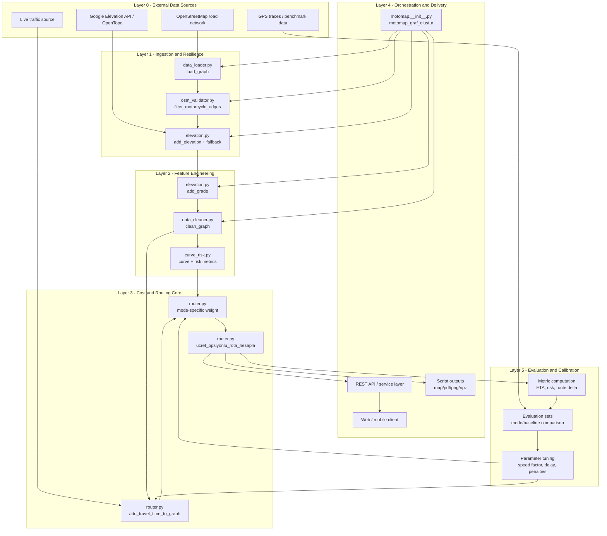
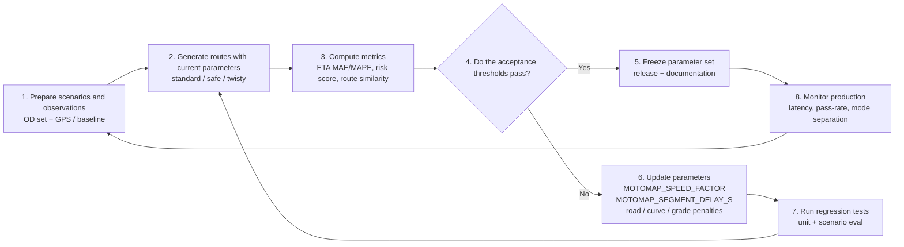

# MotoMap System Layers

This document summarizes MotoMap's end-to-end technical layers and the calibration and evaluation feedback loop in one place.

## 1. High-level layered architecture

## 2. Layer-by-layer purpose

| Layer | What it does | Why it matters | Main components |
|---|---|---|---|
| 0. External data | Supplies roads, elevation, traffic, and observations. | Routing quality depends on real-world inputs. | OSM, Google/OpenTopo, traffic feeds, GPS traces |
| 1. Ingestion | Loads the graph, removes motorcycle-invalid edges, adds resilient elevation fallback. | Dirty or incomplete inputs become routing defects quickly. | `data_loader.py`, `osm_validator.py`, `elevation.py` |
| 2. Feature engineering | Computes grade, fills lanes/speed/surface, derives curve and risk metrics. | Raw OSM tags are not enough to explain rider cost. | `add_grade`, `clean_graph`, `add_curve_and_risk_metrics` |
| 3. Routing core | Builds time-based costs plus mode-specific weights and toll/free choices. | Converts rider intent into numeric optimization. | `router.py` |
| 4. Delivery | Orchestrates the pipeline and exposes results to APIs, apps, and artifacts. | Bridges the routing engine with actual product surfaces. | `motomap_graf_olustur`, service layer, output scripts |
| 5. Evaluation | Measures KPIs, compares baselines, and tunes parameters. | Prevents regressions and aligns the model with real behavior. | metrics, eval scripts, tuning loops |

## 3. Calibration and evaluation loop

Notes:

- This is a continuous quality loop, not a one-off exercise.
- `speed_factor` and `segment_delay` are the first levers to tune when ETA drift appears.

## 4. Short glossary

| Term | Short explanation |
|---|---|
| OD (Origin-Destination) | A start and destination pair. |
| Edge | A directed road connection in the graph. |
| Grade | Road slope ratio. Positive for climbs, negative for descents. |
| Curvature | How twisty a road is. |
| Baseline | A reference system or route result used for comparison. |
| Calibration | Adjusting parameters against observations. |
| Evaluation | Measuring performance with explicit metrics. |
| KPI | A tracked quality indicator. |
