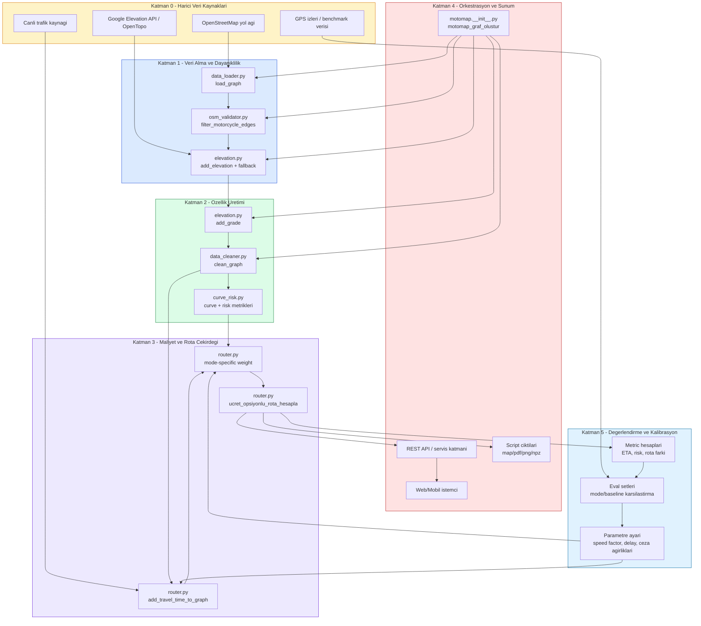
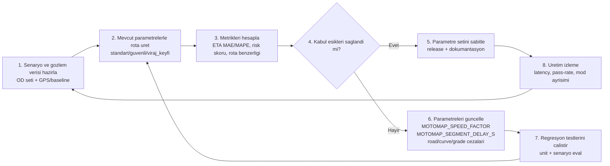

# MotoMap Sistem Katmanlari

Bu dokuman, MotoMap'in uctan uca teknik katmanlarini ve kalibrasyon/degerlendirme geri-besleme dongusunu tek yerde ozetler.

## 1) Ana Mimari (Katmanli)

## 2) Katman Bazli Ne / Neden

| Katman | Ne yapar? | Neden gerekli? | Baslica bilesenler |
|---|---|---|---|
| 0. Harici veri | Yol, yukseklik, trafik ve gozlem verisini saglar. | Rota motoru dogru model icin gercek dunya girdisine baglidir. | OSM, Google/OpenTopo, trafik feed, GPS izleri |
| 1. Veri alma | Grafin cekilmesi, motosiklete uygun olmayan kenarlarin elenmesi, elevation fallback. | Kirli/eksik veri dogrudan rota hatasina donusur; dayaniklilik gerekir. | `data_loader.py`, `osm_validator.py`, `elevation.py` |
| 2. Ozellik uretimi | Egim, serit/speed/surface tamamlama, viraj ve risk metrikleri. | Ham OSM etiketi tek basina rota maliyetini aciklamaz. | `add_grade`, `clean_graph`, `add_curve_and_risk_metrics` |
| 3. Cekirdek rota | Sure tabanli temel maliyet + mod bazli agirlik + ucretli/ucretsiz secim. | Kullanici tercihini (standart/guvenli/viraj keyfi) sayisal optimizasyona cevirir. | `router.py` |
| 4. Sunum | Pipeline orkestrasyonu, API entegrasyonu, istemciye sonuc sunumu. | Cekirdek algoritmayi urun arayuzu ile birlestirir. | `motomap_graf_olustur`, servis katmani, script ciktilari |
| 5. Eval+kalibrasyon | KPI olcumu, baseline karsilastirmasi, parametre geri beslemesi. | Modeli sahadaki davranisa yaklastirir ve regresyonu sinirlar. | metric/eval scriptleri, parametre tuning |

## 3) Kalibrasyon / Degerlendirme Dongusu (Flow)

Kisa not:
- Dongu tek seferlik degil, surekli calisan bir kalite kontrol mekanizmasidir.
- Ozellikle `speed_factor` ve `segment_delay` ETA kalibrasyonunda ilk oynanan parametrelerdir.

## 4) Kisa Sozluk

| Terim | Kisa aciklama |
|---|---|
| OD (Origin-Destination) | Baslangic-varis nokta cifti. |
| Edge | Yol grafindaki yonlu baglanti (yol parcasi). |
| Grade | Yolun egim orani (pozitif: tirmanis, negatif: inis). |
| Curvature | Yolun virajlilik seviyesi (aci/sekil degisimi). |
| Baseline | Karsilastirma icin referans sistem veya rota sonucu. |
| Calibration | Parametreleri gozleme gore ayarlama sureci. |
| Evaluation | KPI metrikleriyle performans olcumu. |
| KPI | Kaliteyi takip etmek icin secilen ana olcum gostergesi. |
