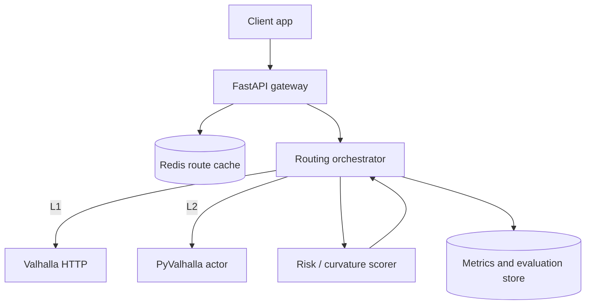
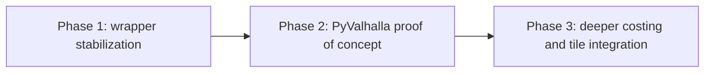

## Concrete Valhalla Integration Plan for MOTOMAP

This discussion was already pointing in the right direction from an architecture, performance, and scaling perspective. The plan below turns that direction into a concrete execution path for MOTOMAP.

### 1. Current state

| Level | Description | MOTOMAP status | Risk | Next step |
|---|---|---|---|---|
| L1 - API wrapper | HTTP calls to Valhalla | working (`--backend valhalla`) | network latency, rate limiting | measurement and cache |
| L2 - Native binding | local actor via `pyvalhalla` | planned | tile operations are operationally heavier | Istanbul tile proof of concept |
| L3 - Custom costing/data | C++ costing plugin plus enriched tiles | concept stage | higher development cost | narrow pilot |

### 2. Target architecture

### 3. MotoMap-focused cost model

Total edge cost:

$$
C_e = T_e \cdot P_{surface}(e) \cdot P_{curve}(e) \cdot P_{grade}(e) \cdot P_{risk}(e)
$$

Where:

$$
T_e = \frac{d_e}{v_e}, \qquad
P_{curve}(e)=1+\alpha\,\kappa_e, \qquad
P_{grade}(e)=1+\beta\,\max(0, g_e-g_0)
$$

Optimization target:

$$
\min_{\pi \in \Pi(s,t)} \sum_{e \in \pi} C_e
$$

Multi-objective score:

$$
J(\pi)=w_t\,\hat T(\pi)-w_f\,\hat F(\pi)+w_r\,\hat R(\pi),
\quad w_t+w_f+w_r=1
$$

### 4. Three-phase implementation plan

| Phase | Goal | Output | Success criterion |
|---|---|---|---|
| Phase 1 | stable HTTP backend | backend-agnostic evaluator plus baseline reports | stable execution across 20/20 batch tests |
| Phase 2 | lower latency with local actor | offline routing through `pyvalhalla` | visible drop in p95 latency |
| Phase 3 | domain-specific quality gains | custom costing and enriched tiles | sustained gains in fun and safety metrics |

### 5. Explicit task list

- [ ] Standardize evaluator checks in `evaluate_with_google.py` so they are baseline-agnostic.
- [ ] Manage the Valhalla endpoint through config and env fallback (`--valhalla-url`).
- [ ] Document the Istanbul tile build pipeline (`extract -> build_tiles -> serve`).
- [ ] Define the Redis cache key schema (`origin,destination,mode,weights`).
- [ ] Benchmark L1 vs L2 with p50/p95/p99 latency, throughput, and error rate.
- [ ] Add a separate experiment script for Meili map matching.
- [ ] Move API keys and tokens fully into a secret manager flow.

### 6. Monitoring metrics

| Metric | Meaning | Target |
|---|---|---|
| `full_pass_rate` | full evaluation pass rate | `>= 85%` |
| `modes_are_different` | separation between routing modes | `>= 95%` |
| `std_time_vs_baseline_ok` | travel-time ratio within target band | `>= 90%` |
| `safe_risk_le_standard` | safe mode keeps risk below standard mode | `100%` |
| `p95_latency_ms` | API latency | lower in L2 than L1 |

Closing view:

L1 is on the right track, but L2 offers the highest return on investment right now. The rational order is `PyValhalla + local tiles + cache` first, then deeper L3 custom costing once that infrastructure is stable.
