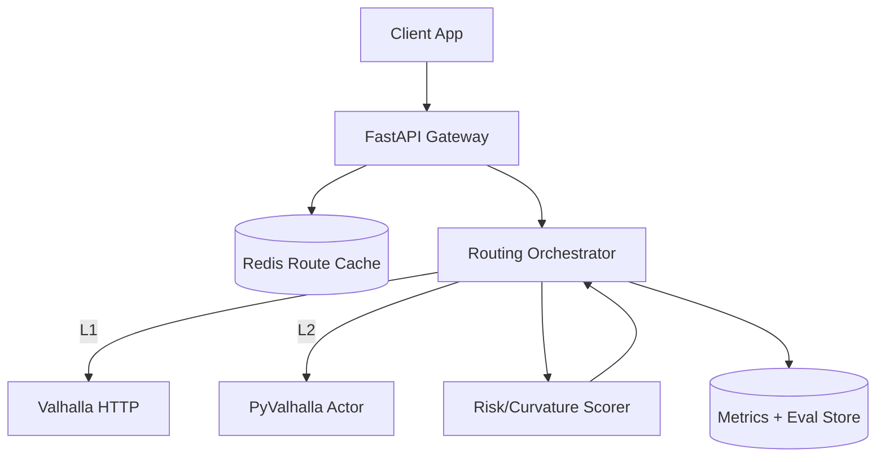
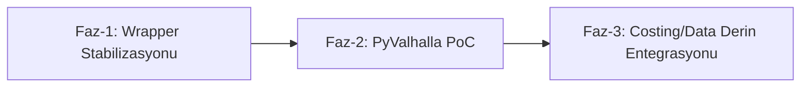

## VALHALLA için Somut Entegrasyon Plani (MOTOMAP)

Çok iyi bir tartisma basligi olmus. Yazdiginiz 4 yorum; mimari, performans ve ölçekleme açisindan dogru eksende.
Asagiya bunu MOTOMAP için uygulanabilir bir plana indirgedim.

### 1) Su anki durum (özet)

| Seviye | Tanim | MOTOMAP Durumu | Risk | Sonraki Adim |
|---|---|---|---|---|
| L1 - API Wrapper | HTTP ile Valhalla çagrisi | Çalisiyor (`--backend valhalla`) | Ag gecikmesi, rate-limit | Ölçüm + cache |
| L2 - Native Binding | `pyvalhalla` ile local actor | Planlandi | Tile operasyon karmasikligi | Istanbul tile PoC |
| L3 - Custom Costing/Data | C++ costing plugin + tile enrichment | Konsept asamasi | Gelistirme maliyeti | Dar kapsamli pilot |

### 2) Hedef mimari

### 3) Cost modeli (MOTOMAP odakli)

Toplam kenar maliyeti:

$$
C_e = T_e \cdot P_{surface}(e) \cdot P_{curve}(e) \cdot P_{grade}(e) \cdot P_{risk}(e)
$$

Burada:

$$
T_e = \frac{d_e}{v_e}, \qquad
P_{curve}(e)=1+\alpha\,\kappa_e, \qquad
P_{grade}(e)=1+\beta\,\max(0, g_e-g_0)
$$

Optimizasyon hedefi:

$$
\min_{\pi \in \Pi(s,t)} \sum_{e \in \pi} C_e
$$

Çok amaçli (süre + keyif + güvenlik) skor:

$$
J(\pi)=w_t\,\hat T(\pi)-w_f\,\hat F(\pi)+w_r\,\hat R(\pi),
\quad w_t+w_f+w_r=1
$$

### 4) 3 fazli uygulama plani

| Faz | Hedef | Çikti | Basari Kriteri |
|---|---|---|---|
| Faz-1 | HTTP backend stabil | backend-agnostic evaluator + baseline raporlari | 20/20 batch testte stabil çalisma |
| Faz-2 | Local actor hiz kazanimi | `pyvalhalla` ile offline routing | p95 latency'de belirgin düsüs |
| Faz-3 | Domain-specific kalite | custom costing + enriched tiles | fun/safety metriklerinde kalici artis |

### 5) TODO (net is listesi)

- [ ] `evaluate_with_google.py` içinde tüm check isimlerini baseline-agnostic standarda tasi
- [ ] Valhalla URL'yi config/env ile yönet (`--valhalla-url` + env fallback)
- [ ] Istanbul tile build pipeline dokümantasyonu (`extract -> build_tiles -> serve`)
- [ ] Redis route cache anahtar semasi tanimla (`origin,destination,mode,weights`)
- [ ] L1 vs L2 benchmark (p50/p95/p99 latency, req/s, error rate)
- [ ] Map-matching (Meili) için ayri deney scripti ekle
- [ ] Güvenlik: API key ve token yönetimini tamamen secret manager'a tasi

### 6) Izleme metrikleri

| Metrik | Açiklama | Hedef |
|---|---|---|
| `full_pass_rate` | Eval case tam geçme orani | >= %85 |
| `modes_are_different` | Modlarin ayrismasi | >= %95 |
| `std_time_vs_baseline_ok` | Süre orani bandi | >= %90 |
| `safe_risk_le_standard` | Güvenli mod risk üstünlügü | %100 |
| `p95_latency_ms` | API gecikmesi | L1'e göre L2'de düsüs |

Kapanis:
L1 tarafi dogru yolda. En yüksek ROI su anda L2 (PyValhalla + local tiles + cache).
Bunu tamamladiktan sonra L3'e geçmek, teoriyi ürüne dönüstüren en rasyonel sira olur.
