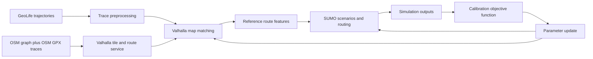
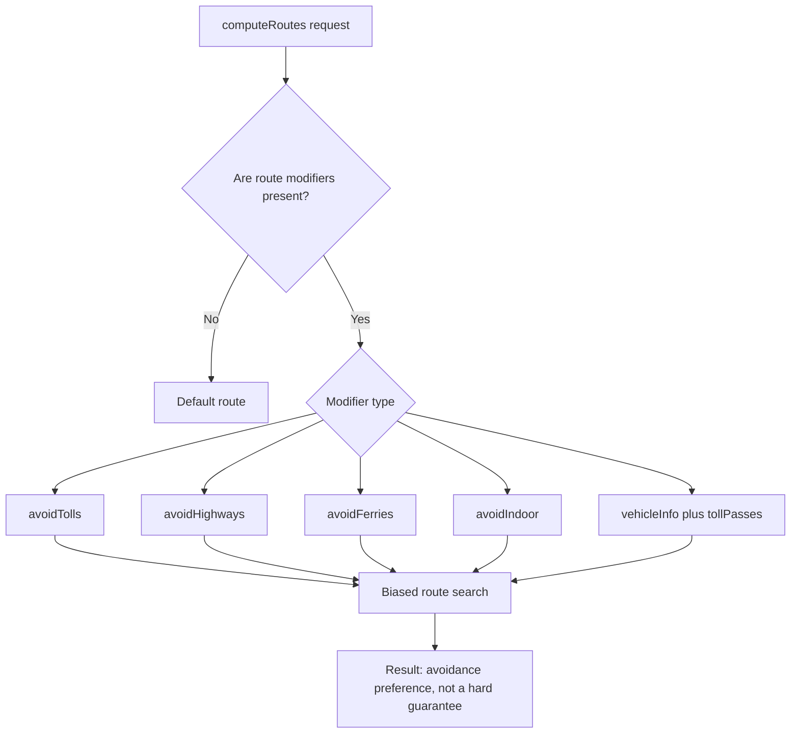
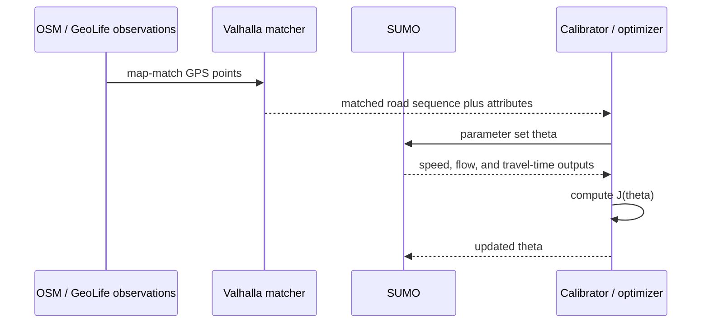

# Valhalla, Google Route Modifiers, SUMO, OSM Traces, GeoLife - Source Note

**Date:** 2026-03-02

This note collects the main official internet sources for route- and trace-based calibration work in one place.

## 1. Quick source matrix

| Topic | Practical value | Main sources |
|---|---|---|
| Valhalla | OSM-based routing and map matching with `trace_route` and `trace_attributes` | [Valhalla Docs](https://valhalla.github.io/valhalla/), [Map Matching API](https://valhalla.github.io/valhalla/api/map-matching/api-reference/), [Meili Algorithms](https://valhalla.github.io/valhalla/meili/algorithms/) |
| Google Route Modifiers | `avoidTolls`, `avoidHighways`, `avoidFerries`, `avoidIndoor`, `vehicleInfo`, `tollPasses` | [Route modifiers guide](https://developers.google.com/maps/documentation/routes/route-modifiers), [RouteModifiers reference](https://developers.google.com/maps/documentation/routes/reference/rest/v2/RouteModifiers) |
| SUMO | Microscopic traffic simulation, re-routing, and calibrators for flow and speed tuning | [SUMO Docs](https://sumo.dlr.de/docs/index.html), [Routing](https://sumo.dlr.de/docs/Simulation/Routing.html), [Calibrator](https://sumo.dlr.de/docs/Simulation/Calibrator.html) |
| OSM traces | GPX trace retrieval/upload and privacy semantics | [API v0.6](https://wiki.openstreetmap.org/wiki/API_v0.6), [Visibility of GPS traces](https://wiki.openstreetmap.org/wiki/Visibility_of_GPS_traces) |
| GeoLife | Real-world GPS trajectories for calibration and benchmarking | [GeoLife User Guide](https://www.microsoft.com/en-us/research/publication/geolife-gps-trajectory-dataset-user-guide/), [GeoLife service paper](https://www.microsoft.com/en-us/research/publication/geolife-a-collaborative-social-networking-service-among-user-location-and-trajectory/) |

## 2. End-to-end flow proposal

## 3. Google `routeModifiers` decision flow

Google's documentation explicitly states that modifiers bias the result rather than enforcing an absolute exclusion, and that the Route Matrix endpoint does not support these avoidance modifiers.

## 4. Calibration loop

## 5. Calibration objective function

Total loss:

$$
\min_{\theta} J(\theta)=
w_t \cdot \frac{1}{N}\sum_{i=1}^{N}\frac{|T_i^{sim}(\theta)-T_i^{obs}|}{\sigma_T}
+ w_v \cdot \frac{1}{N}\sum_{i=1}^{N}\frac{|Q_i^{sim}(\theta)-Q_i^{obs}|}{\sigma_Q}
+ w_m \cdot (1-\mathrm{F1}_{map}(\theta))
+ w_r \cdot \mathrm{KL}\!\left(P^{sim}_{route}\,\|\,P^{obs}_{route}\right)
+ \lambda \|\theta-\theta_0\|_2^2
$$

Weight constraint:

$$
\sum_{k\in\{t,v,m,r\}} w_k = 1,\quad w_k \ge 0
$$

If map matching should also be tracked through negative log-likelihood:

$$
\mathcal{L}_{mm}(\theta) = -\sum_{j=1}^{M}\log p(s_j \mid z_j;\theta)
$$

## 6. Measurement table

| Metric | Formula / measurement | Data source | Interpretation |
|---|---|---|---|
| Travel-time error | MAE or MAPE | SUMO output vs observation | first-line KPI |
| Flow error | \|Q_sim - Q_obs\| | SUMO calibrator or target flows | directly tied to the calibrator |
| Map-matching quality | F1, path overlap | Valhalla `trace_route` / `trace_attributes` | sensitive to `gps_accuracy` and `search_radius` |
| Route-distribution fit | KL divergence | observed route choices vs simulation | behavioral fit |

## 7. Short technical notes

- Valhalla: `shape_match` supports `edge_walk`, `map_snap`, and `walk_or_snap`. For real GPS traces, `map_snap` or `walk_or_snap` is usually safer.
- Google route modifiers: avoidance settings steer the cost function, but the undesired feature can still remain in the route if no practical alternative exists.
- SUMO: the default objective is lowest travel time. `--weights.priority-factor` and rerouting modes can shift behavior.
- SUMO calibrator: `vehsPerHour`, `speed`, and `jamThreshold` are useful for flow and speed tuning in observation-driven scenarios.
- OSM traces API: `GET /api/0.6/trackpoints` retrieves points through bbox and pagination, `POST /api/0.6/gpx` uploads traces, and privacy modes change visibility.
- GeoLife: strong benchmark source because of user count, total distance and duration, and dense sampling.

## 8. TODO

- [ ] Produce a pilot map-matching quality report with Valhalla `trace_route`.
- [ ] Test Google `routeModifiers` variants on the same OD pairs.
- [ ] Sweep SUMO calibrator ranges (`vehsPerHour`, `speed`, `jamThreshold`) with grid search.
- [ ] Separate usable OSM trace datasets by privacy type.
- [ ] Select a GeoLife subset and define train/validation/test partitions.
- [ ] Normalize the initial objective-function weights (`w_t,w_v,w_m,w_r`).

## 9. Internet sources

1. Valhalla Docs: https://valhalla.github.io/valhalla/
2. Valhalla Map Matching API: https://valhalla.github.io/valhalla/api/map-matching/api-reference/
3. Valhalla Meili Algorithms: https://valhalla.github.io/valhalla/meili/algorithms/
4. Google Routes - Route modifiers: https://developers.google.com/maps/documentation/routes/route-modifiers
5. Google Routes - RouteModifiers REST reference: https://developers.google.com/maps/documentation/routes/reference/rest/v2/RouteModifiers
6. SUMO Documentation: https://sumo.dlr.de/docs/index.html
7. SUMO Routing: https://sumo.dlr.de/docs/Simulation/Routing.html
8. SUMO Calibrator: https://sumo.dlr.de/docs/Simulation/Calibrator.html
9. OpenStreetMap API v0.6: https://wiki.openstreetmap.org/wiki/API_v0.6
10. OSM GPS trace visibility: https://wiki.openstreetmap.org/wiki/Visibility_of_GPS_traces
11. GeoLife GPS trajectory dataset - User Guide: https://www.microsoft.com/en-us/research/publication/geolife-gps-trajectory-dataset-user-guide/
12. GeoLife social networking paper: https://www.microsoft.com/en-us/research/publication/geolife-a-collaborative-social-networking-service-among-user-location-and-trajectory/
