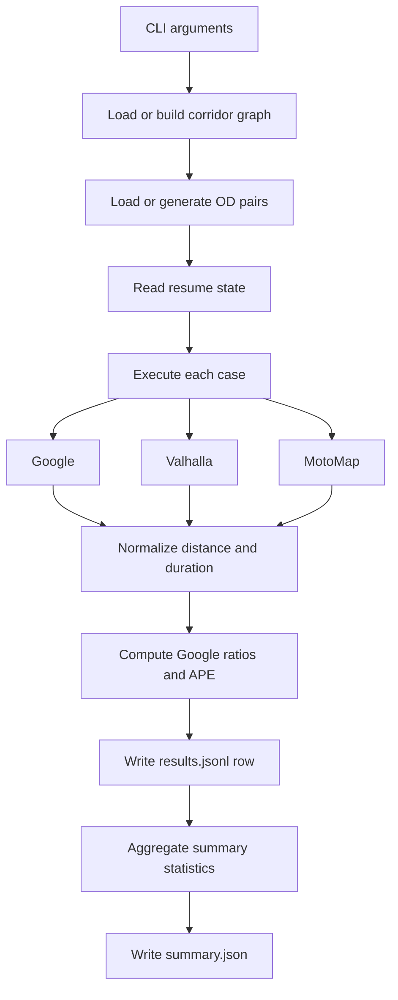

[](istanbul-antalya-10k.md)
[](istanbul-antalya-10k.tr.md)

# Istanbul-Antalya 10K Benchmark

## Purpose

This benchmark compares three routing engines on a long-distance corridor from the Istanbul region to the Antalya region:

- Google Directions API
- Valhalla
- MotoMap

Primary evaluation focus:

- distance and duration deltas
- ratios relative to Google
- absolute percentage error metrics (APE, MAPE)
- stability across a large sample size of 10,000 cases

## Pipeline



## Outputs

- pair file: `--pairs-json`
- row-level resumable results: `--results-jsonl`
- summary report: `--summary-json`
- cached corridor graph: `--graph-cache`

## Metrics

Google is treated as the reference:

- `distance_ratio = engine_distance / google_distance`
- `duration_ratio = engine_duration / google_duration`
- `distance_ape_pct = |engine_distance - google_distance| / google_distance * 100`
- `duration_ape_pct = |engine_duration - google_duration| / google_duration * 100`

Interpretation:

- `ratio = 1.0` means identical to the reference
- `ratio > 1.0` means longer than the reference
- `ratio < 1.0` means shorter than the reference
- lower APE/MAPE means closer agreement with Google

## Commands

### Build the C++ sampler (optional)

The `embeddings` directory contains a C++ O-D sampler. The benchmark script tries to compile it automatically, but you can build it manually with:

```powershell
powershell -ExecutionPolicy Bypass -File embeddings/build_od_sampler.ps1
```

### Dry run

Preparation plus summary only:

```bash
python website/benchmark_istanbul_antalya_10k.py \
  --count 10000 \
  --dry-run \
  --pairs-json website/routes/ia_pairs.json \
  --results-jsonl website/routes/ia_results.jsonl \
  --summary-json website/routes/ia_summary.json \
  --graph-cache website/cache/ia_corridor.graphml
```

Force the Python sampler:

```bash
python website/benchmark_istanbul_antalya_10k.py --disable-cpp-sampler --dry-run
```

Force the C++ sampler:

```bash
python website/benchmark_istanbul_antalya_10k.py --force-cpp-sampler --dry-run
```

### Smoke run

```bash
python website/benchmark_istanbul_antalya_10k.py \
  --count 10 \
  --seed 123 \
  --pairs-json website/routes/ia_smoke_pairs.json \
  --results-jsonl website/routes/ia_smoke_results.jsonl \
  --summary-json website/routes/ia_smoke_summary.json \
  --graph-cache website/cache/ia_smoke.graphml
```

### Full run

```bash
python website/benchmark_istanbul_antalya_10k.py \
  --count 10000 \
  --seed 42 \
  --pairs-json website/routes/ia_10k_pairs.json \
  --results-jsonl website/routes/ia_10k_results.jsonl \
  --summary-json website/routes/ia_10k_summary.json \
  --graph-cache website/cache/ia_10k.graphml \
  --google-qps 6 \
  --valhalla-qps 2
```

### Resume

Re-run the command with the same `--pairs-json` and `--results-jsonl`. The script skips completed `case_id` entries automatically.

## Practical Notes

- 10,000 Google calls are expensive; run a smoke test first.
- Public Valhalla services can fluctuate in latency and availability.
- Start with conservative QPS values and increase them gradually.
- `results.jsonl` is the critical artifact for long resumable runs.
- If you use MinGW inside a Conda environment, DLL conflicts can appear. The script reduces this risk by pushing the `g++` directory to the front of `PATH`.
- Sampler selection is automatic by default: Python is preferred for small and medium batches, while C++ is tried for very large batches. Above the threshold, the script runs a short micro-benchmark and picks the faster option.
