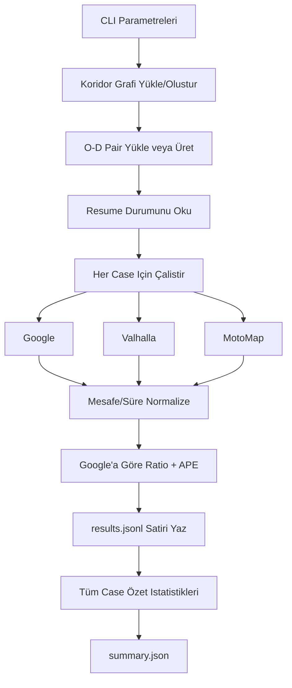

[](istanbul-antalya-10k.md)
[](istanbul-antalya-10k.tr.md)

# Istanbul-Antalya 10K Benchmark

## Amaç
Bu benchmark'in hedefi, uzun mesafede (Istanbul bölgesi -> Antalya bölgesi) üç motoru karsilastirmaktir:

- Google Directions API
- Valhalla
- MotoMap algoritmasi

Ana odak:

- Mesafe ve süre farklari
- Google'a göre oranlar (ratio)
- Google'a göre hata yüzdeleri (APE, MAPE)
- Büyük örneklemde (10.000 case) stabilite

## Pipeline



## Çiktilar

- Pair dosyasi: `--pairs-json`
- Satir bazli sonuçlar (resume dostu): `--results-jsonl`
- Özet rapor: `--summary-json`
- Koridor graph cache: `--graph-cache`

## Metrikler

Google referans alinir:

- `distance_ratio = engine_distance / google_distance`
- `duration_ratio = engine_duration / google_duration`
- `distance_ape_pct = |engine_distance - google_distance| / google_distance * 100`
- `duration_ape_pct = |engine_duration - google_duration| / google_duration * 100`

Yorum:

- `ratio = 1.0` -> referansla ayni
- `ratio > 1.0` -> daha uzun
- `ratio < 1.0` -> daha kisa
- APE/MAPE düsükse Google'a yakinlik artar

## Komutlar

### C++ sampler derleme (opsiyonel)
`embeddings` klasöründe C++ O-D sampler bulunur. Script bunu otomatik derlemeyi dener.
Manuel derleme için:

```powershell
powershell -ExecutionPolicy Bypass -File embeddings/build_od_sampler.ps1
```

### Dry-run (sadece hazirlik + özet)
```bash
python website/benchmark_istanbul_antalya_10k.py \
  --count 10000 \
  --dry-run \
  --pairs-json website/routes/ia_pairs.json \
  --results-jsonl website/routes/ia_results.jsonl \
  --summary-json website/routes/ia_summary.json \
  --graph-cache website/cache/ia_corridor.graphml
```

Python sampler'a zorla dönmek için:
```bash
python website/benchmark_istanbul_antalya_10k.py --disable-cpp-sampler --dry-run
```

C++ sampler'i zorla kullanmak için:
```bash
python website/benchmark_istanbul_antalya_10k.py --force-cpp-sampler --dry-run
```

### Smoke (10 case)
```bash
python website/benchmark_istanbul_antalya_10k.py \
  --count 10 \
  --seed 123 \
  --pairs-json website/routes/ia_smoke_pairs.json \
  --results-jsonl website/routes/ia_smoke_results.jsonl \
  --summary-json website/routes/ia_smoke_summary.json \
  --graph-cache website/cache/ia_smoke.graphml
```

### Full (10.000 case)
```bash
python website/benchmark_istanbul_antalya_10k.py \
  --count 10000 \
  --seed 42 \
  --pairs-json website/routes/ia_10k_pairs.json \
  --results-jsonl website/routes/ia_10k_results.jsonl \
  --summary-json website/routes/ia_10k_summary.json \
  --graph-cache website/cache/ia_10k.graphml \
  --google-qps 6 \
  --valhalla-qps 2
```

### Resume (kaldigi yerden devam)
Ayni `--pairs-json` ve `--results-jsonl` ile komutu tekrar çalistirin. Script, tamamlanan `case_id` kayitlarini atlar.

## Pratik Notlar

- 10.000 Google çagrisi maliyetlidir; önce smoke kosusu önerilir.
- Public Valhalla servislerinde hiz ve erisim dalgalanabilir.
- QPS degerlerini düsük baslayip kademeli artirmak daha güvenlidir.
- Uzun kosularda `results.jsonl` dosyasi resume için kritik artefakttir.
- Conda ortaminda MinGW kullaniyorsaniz DLL çakismasi yasanabilir; script, `g++` klasörünü PATH basina alarak bunu otomatik azaltir.
- Sampler modu varsayilan olarak otomatik seçilir: küçük/orta batch'lerde Python, çok büyük batch'lerde C++ denenir; esik üstünde kisa bir mikro-benchmark ile hizli olan seçilir.
