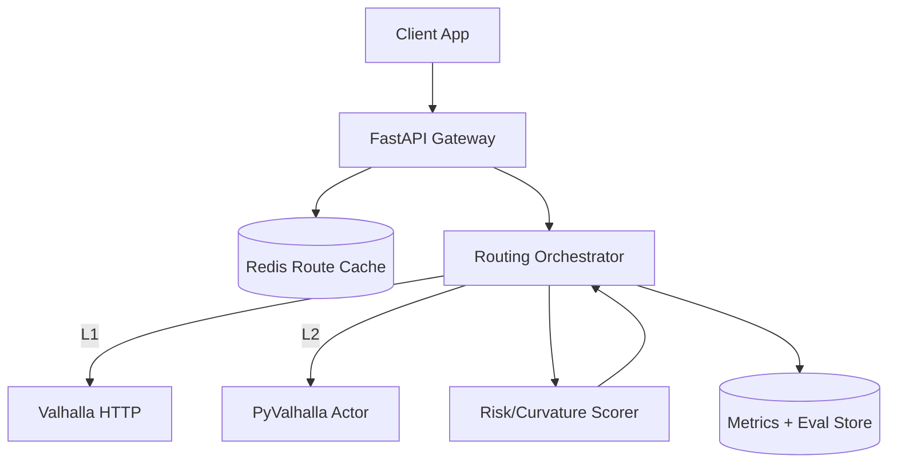
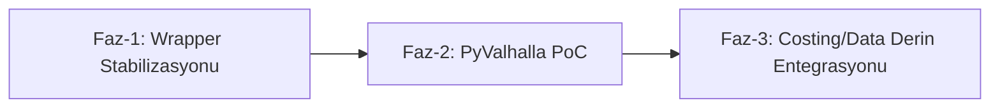

## VALHALLA için Somut Entegrasyon Planı (MOTOMAP)

Çok iyi bir tartışma başlığı olmuş. Yazdığınız 4 yorum; mimari, performans ve ölçekleme açısından doğru eksende.
Aşağıya bunu MOTOMAP için uygulanabilir bir plana indirgedim.

### 1) Şu anki durum (özet)

| Seviye | Tanım | MOTOMAP Durumu | Risk | Sonraki Adım |
|---|---|---|---|---|
| L1 - API Wrapper | HTTP ile Valhalla çağrısı | Çalışıyor (`--backend valhalla`) | Ağ gecikmesi, rate-limit | Ölçüm + cache |
| L2 - Native Binding | `pyvalhalla` ile local actor | Planlandı | Tile operasyon karmaşıklığı | İstanbul tile PoC |
| L3 - Custom Costing/Data | C++ costing plugin + tile enrichment | Konsept aşaması | Geliştirme maliyeti | Dar kapsamlı pilot |

### 2) Hedef mimari

### 3) Cost modeli (MOTOMAP odaklı)

Toplam kenar maliyeti:

$$
C_e = T_e \cdot P_{surface}(e) \cdot P_{curve}(e) \cdot P_{grade}(e) \cdot P_{risk}(e)
$$

Burada:

$$
T_e = \frac{d_e}{v_e}, \qquad
P_{curve}(e)=1+\alpha\,\kappa_e, \qquad
P_{grade}(e)=1+\beta\,\max(0, g_e-g_0)
$$

Optimizasyon hedefi:

$$
\min_{\pi \in \Pi(s,t)} \sum_{e \in \pi} C_e
$$

Çok amaçlı (süre + keyif + güvenlik) skor:

$$
J(\pi)=w_t\,\hat T(\pi)-w_f\,\hat F(\pi)+w_r\,\hat R(\pi),
\quad w_t+w_f+w_r=1
$$

### 4) 3 fazlı uygulama planı

| Faz | Hedef | Çıktı | Başarı Kriteri |
|---|---|---|---|
| Faz-1 | HTTP backend stabil | backend-agnostic evaluator + baseline raporları | 20/20 batch testte stabil çalışma |
| Faz-2 | Local actor hız kazanımı | `pyvalhalla` ile offline routing | p95 latency'de belirgin düşüş |
| Faz-3 | Domain-specific kalite | custom costing + enriched tiles | fun/safety metriklerinde kalıcı artış |

### 5) TODO (net iş listesi)

- [ ] `evaluate_with_google.py` içinde tüm check isimlerini baseline-agnostic standarda taşı
- [ ] Valhalla URL'yi config/env ile yönet (`--valhalla-url` + env fallback)
- [ ] Istanbul tile build pipeline dokümantasyonu (`extract -> build_tiles -> serve`)
- [ ] Redis route cache anahtar şeması tanımla (`origin,destination,mode,weights`)
- [ ] L1 vs L2 benchmark (p50/p95/p99 latency, req/s, error rate)
- [ ] Map-matching (Meili) için ayrı deney scripti ekle
- [ ] Güvenlik: API key ve token yönetimini tamamen secret manager'a taşı

### 6) İzleme metrikleri

| Metrik | Açıklama | Hedef |
|---|---|---|
| `full_pass_rate` | Eval case tam geçme oranı | >= %85 |
| `modes_are_different` | Modların ayrışması | >= %95 |
| `std_time_vs_baseline_ok` | Süre oranı bandı | >= %90 |
| `safe_risk_le_standard` | Güvenli mod risk üstünlüğü | %100 |
| `p95_latency_ms` | API gecikmesi | L1'e göre L2'de düşüş |

Kapanış: 
L1 tarafı doğru yolda. En yüksek ROI şu anda L2 (PyValhalla + local tiles + cache). 
Bunu tamamladıktan sonra L3'e geçmek, teoriyi ürüne dönüştüren en rasyonel sıra olur.
