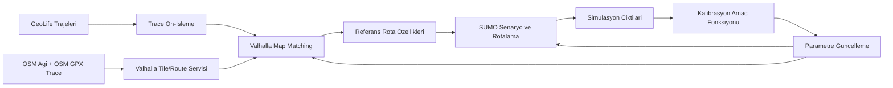
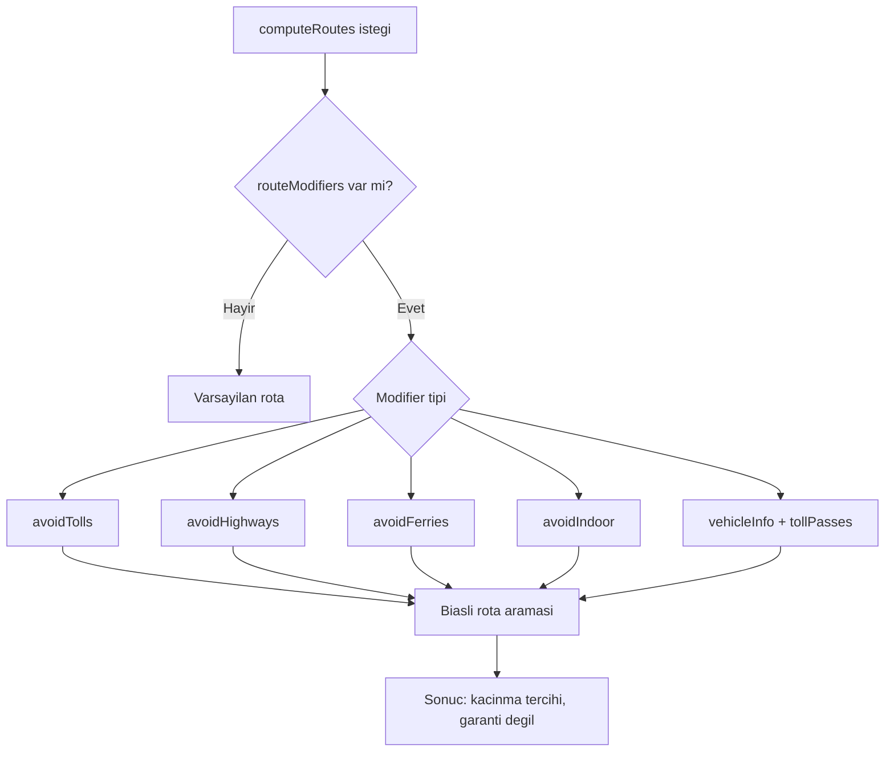
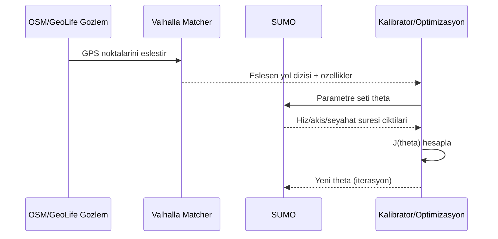

# Valhalla, Google Route Modifiers, SUMO, OSM Traces, GeoLife - Kaynak Notu

Tarih: 2026-03-02

Bu not, rota/iz tabanli kalibrasyon calismasi icin resmi internet kaynaklarini tek yerde toplar.

## 1) Hizli kaynak matrisi

| Konu | Pratik deger | Ana kaynak |
|---|---|---|
| Valhalla | OSM tabanli routing + map matching (`trace_route`, `trace_attributes`) | [Valhalla Docs](https://valhalla.github.io/valhalla/), [Map Matching API](https://valhalla.github.io/valhalla/api/map-matching/api-reference/), [Meili Algorithms](https://valhalla.github.io/valhalla/meili/algorithms/) |
| Google Route Modifiers | `avoidTolls`, `avoidHighways`, `avoidFerries`, `avoidIndoor`, `vehicleInfo`, `tollPasses` | [Route modifiers guide](https://developers.google.com/maps/documentation/routes/route-modifiers), [RouteModifiers reference](https://developers.google.com/maps/documentation/routes/reference/rest/v2/RouteModifiers) |
| SUMO | Mikroskobik simulasyon, yeniden rota, kalibrator ile akis/hiz uyarlama | [SUMO Docs](https://sumo.dlr.de/docs/index.html), [Routing](https://sumo.dlr.de/docs/Simulation/Routing.html), [Calibrator](https://sumo.dlr.de/docs/Simulation/Calibrator.html) |
| OSM traces | GPX iz noktasi alma/yukleme + gizlilik semantigi | [API v0.6](https://wiki.openstreetmap.org/wiki/API_v0.6), [Visibility of GPS traces](https://wiki.openstreetmap.org/wiki/Visibility_of_GPS_traces) |
| GeoLife | Gercek dunya GPS trajeleri ile kalibrasyon/benchmark veri seti | [GeoLife User Guide](https://www.microsoft.com/en-us/research/publication/geolife-gps-trajectory-dataset-user-guide/), [GeoLife service paper](https://www.microsoft.com/en-us/research/publication/geolife-a-collaborative-social-networking-service-among-user-location-and-trajectory/) |

## 2) Uctan uca akis (oneri)

## 3) Google routeModifiers karar akisi

Not: Google dokumani acikca "modifier sonucu biaslar, kesin engelleme garanti etmez" ve "Compute Route Matrix bu kacinma ozelligini desteklemez" diyor.

## 4) Kalibrasyon dongusu

## 5) Kalibrasyon amac fonksiyonu (LaTeX)

Toplam kayip:

$$
\min_{\theta} J(\theta)=
w_t \cdot \frac{1}{N}\sum_{i=1}^{N}\frac{|T_i^{sim}(\theta)-T_i^{obs}|}{\sigma_T}
+ w_v \cdot \frac{1}{N}\sum_{i=1}^{N}\frac{|Q_i^{sim}(\theta)-Q_i^{obs}|}{\sigma_Q}
+ w_m \cdot (1-\mathrm{F1}_{map}(\theta))
+ w_r \cdot \mathrm{KL}\!\left(P^{sim}_{route}\,\|\,P^{obs}_{route}\right)
+ \lambda \|\theta-\theta_0\|_2^2
$$

Agirlik kisiti:

$$
\sum_{k\in\{t,v,m,r\}} w_k = 1,\quad w_k \ge 0
$$

Map-matching tarafini negatif log-olasilikla da izlemek istenirse:

$$
\mathcal{L}_{mm}(\theta) = -\sum_{j=1}^{M}\log p(s_j \mid z_j;\theta)
$$

## 6) Olcut tablosu

| Olcut | Formul/olcum | Veri kaynagi | Yorum |
|---|---|---|---|
| Seyahat suresi hatasi | MAE veya MAPE | SUMO cikti vs gozlem | Ilk seviye KPI |
| Akis hatasi | \|Q_sim - Q_obs\| | SUMO calibrator/hedef akis | Kalibratorla dogrudan bagli |
| Map-matching kalitesi | F1, path overlap | Valhalla `trace_route`/`trace_attributes` | `gps_accuracy`, `search_radius` etkili |
| Rota dagilimi uyumu | KL divergence | Gozlenen rota secimleri vs simulasyon | Davranissal uyum |

## 7) Kisa teknik notlar

- Valhalla: `shape_match` parametresi `edge_walk`, `map_snap`, `walk_or_snap` secenekleri verir. Gercek GPS izi icin genelde `map_snap`/`walk_or_snap` daha guvenli.
- Google route modifiers: Kacinma alanlari maliyet fonksiyonunu yonlendirir; alternatif yoksa istenmeyen oge yine rotada kalabilir.
- SUMO: Varsayilan hedef en dusuk seyahat suresi; `--weights.priority-factor` ve yeniden rota kipleriyle davranis degistirilebilir.
- SUMO calibrator: `vehsPerHour`, `speed`, `jamThreshold` ile akis/hiz dinamik ayari yapar; olcum tabanli senaryo dengelemede kullanisli.
- OSM traces API: `GET /api/0.6/trackpoints` bbox + sayfalama ile nokta ceker; `POST /api/0.6/gpx` yukleme yapar; gizlilik modlari (private/public/trackable/identifiable) farkli veri gorunurlugu saglar.
- GeoLife: Kullanici sayisi, toplam mesafe/sure ve yogun ornekleme orani nedeniyle kalibrasyon ve benchmark icin guclu bir referans set.

## 8) TODO

- [ ] Valhalla `trace_route` ile pilot bir alan icin eslesme kalitesi raporu cikar.
- [ ] Google `routeModifiers` etkisini ayni OD ciftlerinde varyantli test et.
- [ ] SUMO calibrator parametre araliklarini (`vehsPerHour`, `speed`, `jamThreshold`) grid-search ile tara.
- [ ] OSM trace gizlilik tipine gore kullanilabilir veri setini ayristir.
- [ ] GeoLife alt-kumesi secip train/validation/test bolumu tanimla.
- [ ] Amac fonksiyonundaki agirliklari (`w_t,w_v,w_m,w_r`) ilk iterasyonda normalize et.

## 9) Internet kaynaklari

1. Valhalla Docs: https://valhalla.github.io/valhalla/
2. Valhalla Map Matching API: https://valhalla.github.io/valhalla/api/map-matching/api-reference/
3. Valhalla Meili Algorithms: https://valhalla.github.io/valhalla/meili/algorithms/
4. Google Routes - Route modifiers: https://developers.google.com/maps/documentation/routes/route-modifiers
5. Google Routes - RouteModifiers REST reference: https://developers.google.com/maps/documentation/routes/reference/rest/v2/RouteModifiers
6. SUMO Documentation: https://sumo.dlr.de/docs/index.html
7. SUMO Routing: https://sumo.dlr.de/docs/Simulation/Routing.html
8. SUMO Calibrator: https://sumo.dlr.de/docs/Simulation/Calibrator.html
9. OpenStreetMap API v0.6: https://wiki.openstreetmap.org/wiki/API_v0.6
10. OSM GPS trace visibility: https://wiki.openstreetmap.org/wiki/Visibility_of_GPS_traces
11. GeoLife GPS trajectory dataset - User Guide: https://www.microsoft.com/en-us/research/publication/geolife-gps-trajectory-dataset-user-guide/
12. GeoLife social networking paper: https://www.microsoft.com/en-us/research/publication/geolife-a-collaborative-social-networking-service-among-user-location-and-trajectory/
